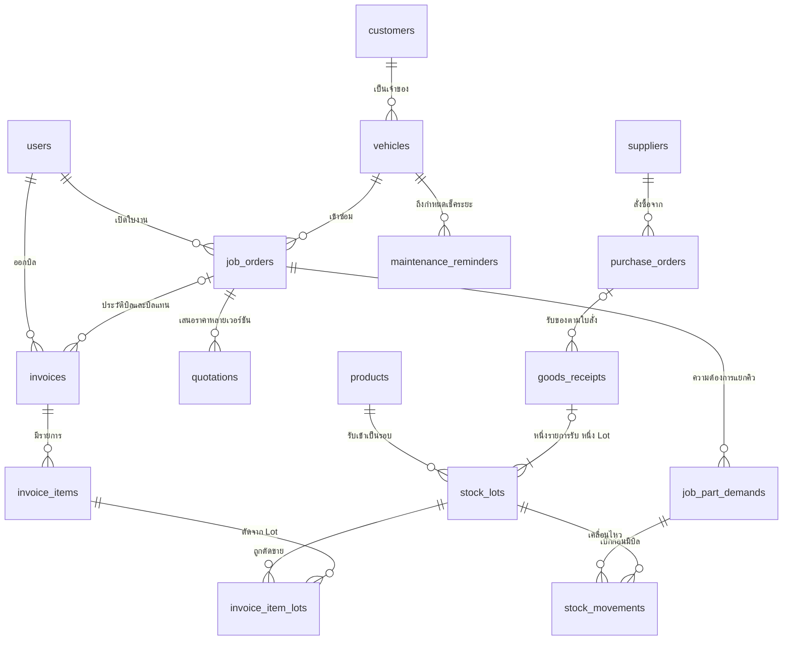
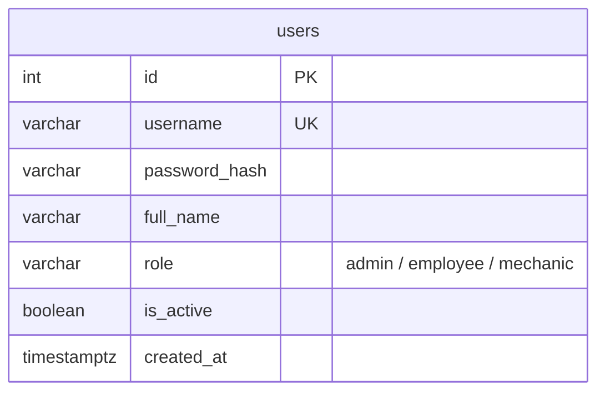
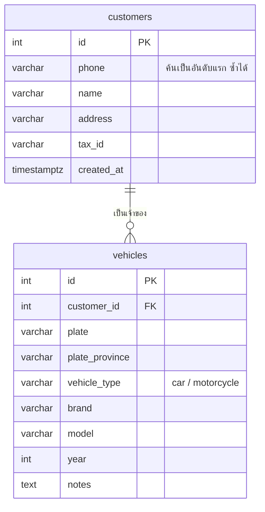
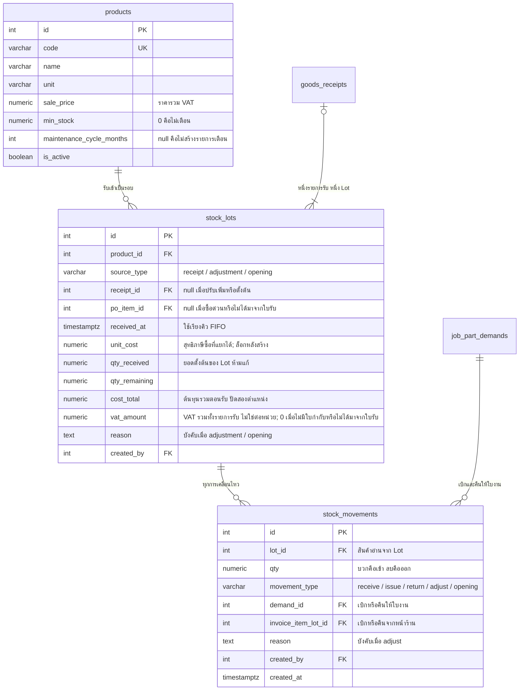
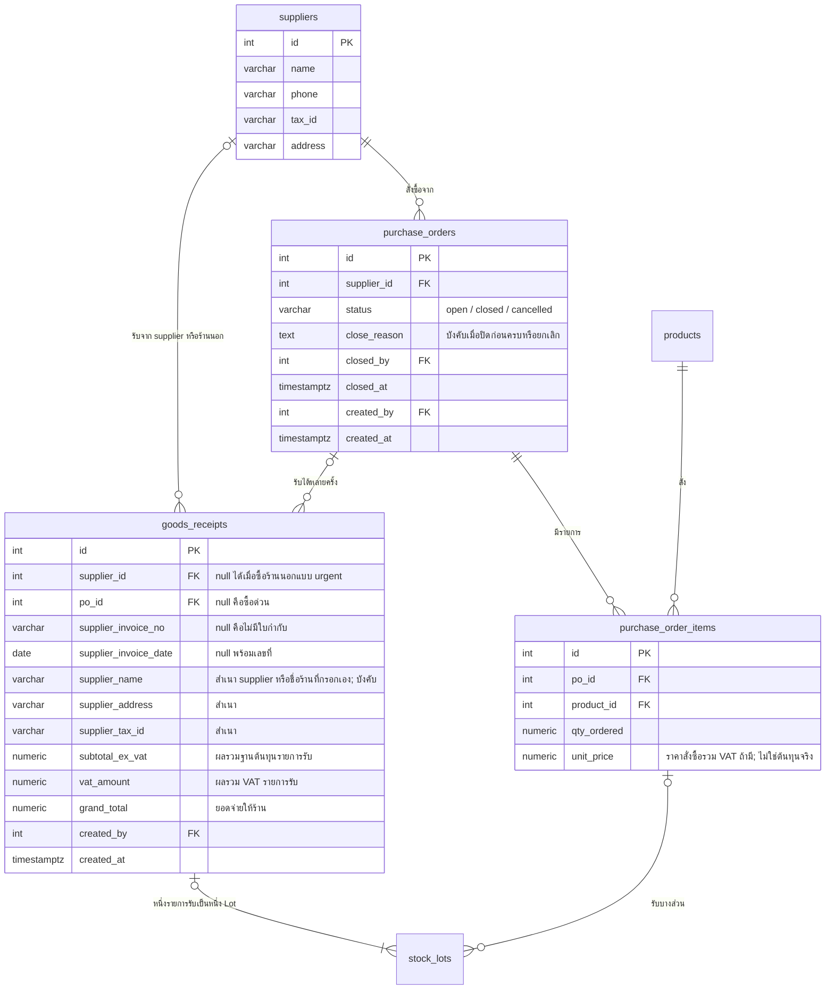
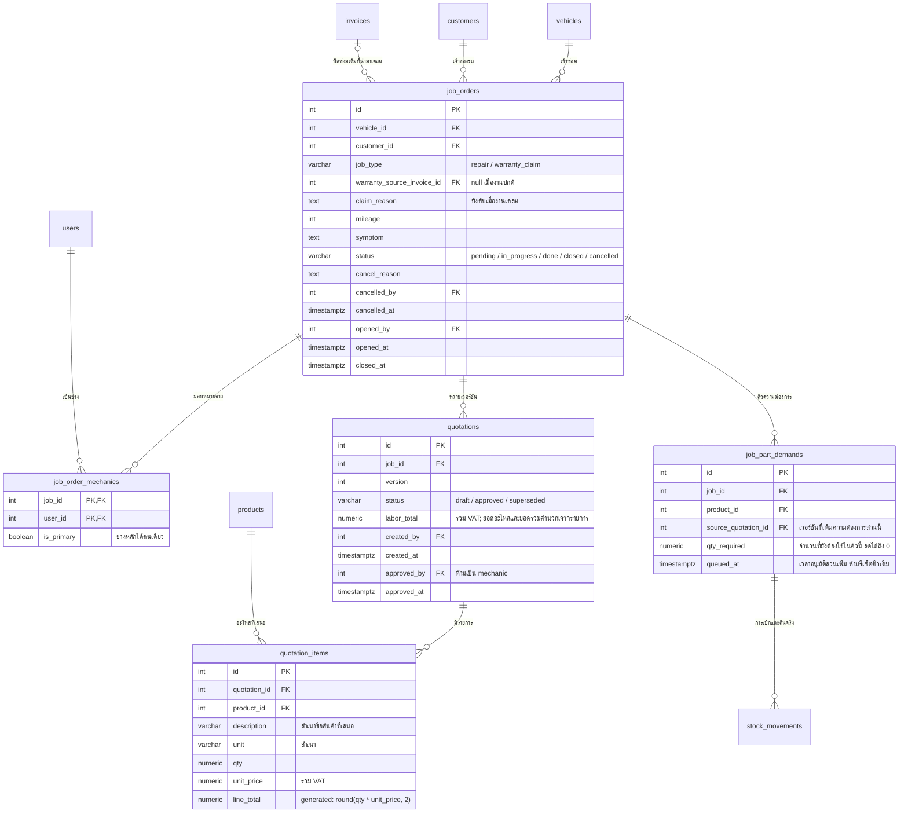
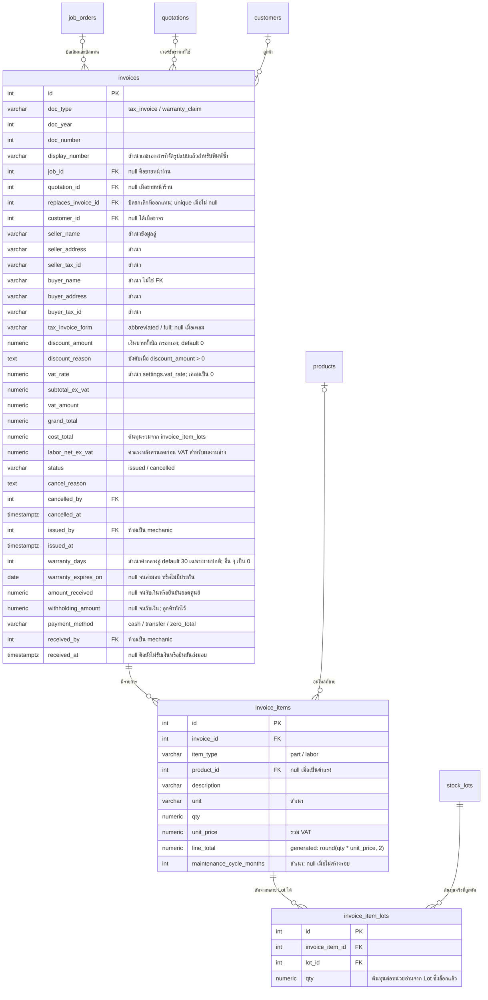
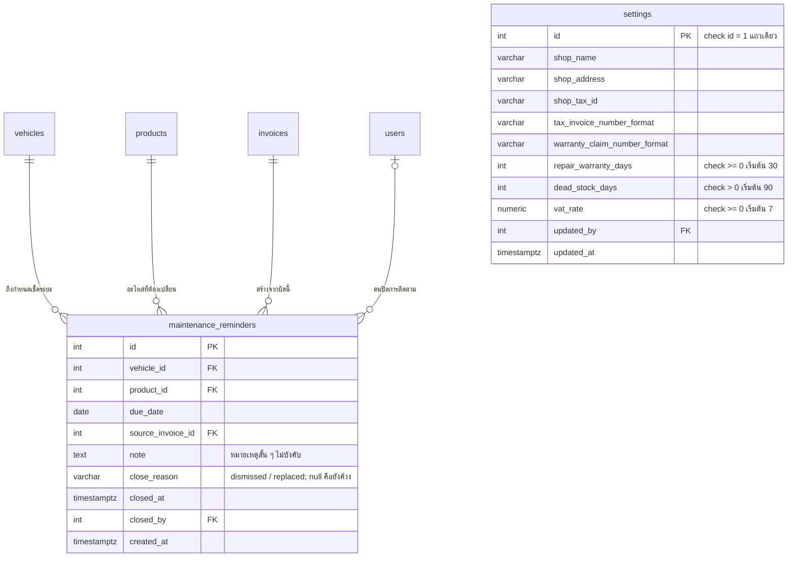
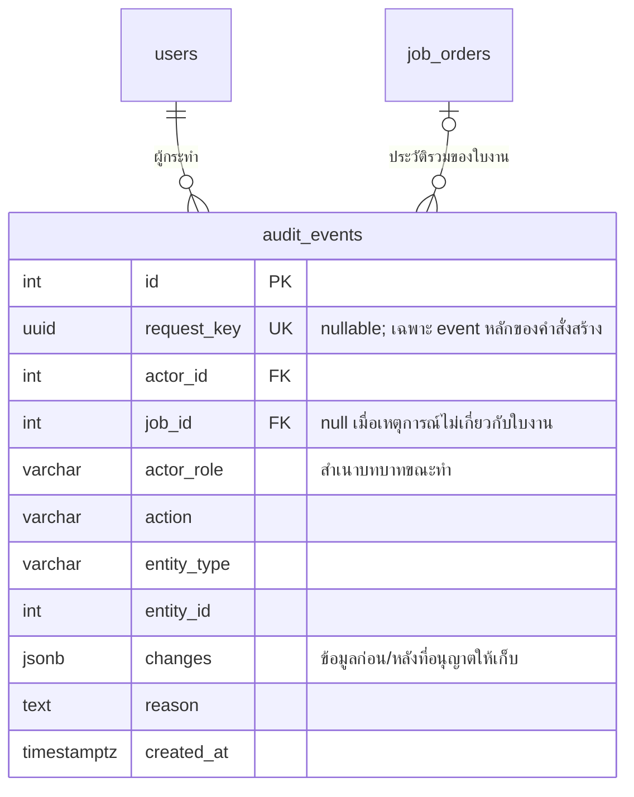

# โครงสร้างฐานข้อมูล

PostgreSQL — 21 ตาราง อ้างอิง `new_scenario_summary.md` และ `screens.md`

ยอดเงินรวมเป็น `numeric(12,2)` ราคาต่อหน่วยและต้นทุนต่อหน่วยเป็น `numeric(14,4)` จำนวนสินค้าเป็น `numeric(12,3)` อัตรา VAT เป็น `numeric(5,2)` ปัดยอดรวมรายการเป็นสองตำแหน่งด้วย decimal arithmetic วันเวลาเหตุการณ์เป็น `timestamptz` วันบนเอกสารเป็น `date` ใช้เขตเวลา Asia/Bangkok และปี ค.ศ. สำหรับรายงานและรอบเลขเอกสาร

ตารางทั่วไปใช้ `id serial` ยกเว้น `job_order_mechanics` ที่ใช้ primary key คู่ และ `settings` ที่มีแถวเดียว `id int primary key check (id = 1)` คอลัมน์ FK ต้องมี index ตามเส้นทางค้นหาจริง Nullability, UNIQUE และ CHECK ที่ระบุด้านล่างเป็นส่วนหนึ่งของ schema ไม่ใช่เพียงคำแนะนำ UI

---

## ภาพรวม



- รถหนึ่งคันมีใบงานได้หลายใบตลอดประวัติ แต่ที่ค้างอยู่ได้ใบเดียว บังคับด้วย partial unique index
- ใบงานหนึ่งใบมีประวัติบิลได้หลายใบ แต่มีบิล `issued` ได้ไม่เกินหนึ่งใบ บิลขายหน้าร้าน `job_id` เป็น null
- หนึ่งรายการขายกินได้หลาย Lot จึงต้องมี `invoice_item_lots` คั่นกลาง
- งานซ่อมเบิกผ่าน `job_part_demands` และ `stock_movements` ที่อ้าง demand ก่อนมีบิล `invoice_item_lots` เป็นสำเนาต้นทุนตอนออกบิล ไม่ใช่คำสั่งเบิกซ้ำ
- ลดโครงสร้างโดยกรอกส่วนลดบน invoices, อ้างบิลซ่อมเดิมจาก job_orders สำหรับเคลม และรวมประวัติสถานะไว้ใน audit_events คงใบสั่งซื้อ ช่างหลายคนต่อใบงาน การตัด FIFO ตาม Lot และรายการเตือนบำรุงรักษาแบบง่าย

---

## 1. ผู้ใช้



`role` บังคับด้วย `CheckConstraint` ที่ฐานข้อมูล ทุกตารางที่บันทึกการกระทำอ้าง `users.id` ผ่านคอลัมน์ `*_by` หรือ `audit_events.actor_id`

---

## 2. ลูกค้าและรถ



ลูกค้าขาจรที่ซื้อของหน้าร้านไม่ถูกบันทึกที่นี่ ข้อมูลผู้ซื้อไปอยู่บนบิลโดยตรง

- สร้าง index ที่เบอร์โทรหลัง normalize และ UNIQUE `(plate_province, plate)` หลัง normalize ทะเบียนและจังหวัดต้องไม่เป็น null รุ่นนี้รับรถที่มีทะเบียนและจังหวัดระบุได้
- `vehicles.customer_id` คือเจ้าของปัจจุบัน `job_orders.customer_id` คือผู้ใช้บริการ ณ วันที่เปิดใบงาน เปลี่ยนเจ้าของรถแล้วประวัติใบงานเดิมไม่เปลี่ยนตาม
- FK ข้อมูลที่มีประวัติธุรกรรมห้าม cascade delete ใช้ปิดใช้งานสำหรับสินค้าและผู้ใช้

---

## 3. สินค้าและคลัง



- หนึ่งรายการรับของ = หนึ่ง Lot เสมอ ไม่ว่าจะมาทางใบสั่งซื้อหรือซื้อด่วน สินค้าเดียวกันหลายรายการรับสร้างคนละ Lot ได้
- FIFO เรียงตาม `received_at` แล้ว `id`
- `qty_remaining` เก็บเป็นตัวเลขจริง ไม่คำนวณสดจาก movements
- การคืนของอ้าง `lot_id` เดิมเสมอ ไม่สร้าง Lot ใหม่
- ปรับเพิ่มและสต็อกตั้งต้นสร้าง Lot แยก `receipt_id = null` โดย Admin ระบุต้นทุนและเหตุผล ไม่สร้างรายการภาษีซื้อ ปรับลดจาก Lot เดิมได้โดย Admin/Employee ช่างปรับไม่ได้
- `qty_received > 0`, `0 <= qty_remaining <= qty_received` ยอดตั้งต้นไม่เปลี่ยนย้อนหลัง ปรับลดไม่ทำให้ยอดตั้งต้นลด ของเกินต้องสร้าง Lot ใหม่
- Lot ของ source_type = receipt คือรายการรับของหนึ่งรายการ ไม่มีตารางรายการรับแยก ต้องมี receipt_id; po_item_id มีได้เมื่อใบรับเป็น po และต้องอยู่ใน PO เดียวกันกับสินค้าตรงกัน source_type = adjustment/opening ต้องไม่มี receipt_id/po_item_id, vat_amount = 0, ต้องมีเหตุผล และมี movement บวกแรกเป็น adjust/opening ตามชนิด Lot บังคับด้วย CHECK ในแถว
- movement ไม่เก็บ product_id ซ้ำ อ่านจาก Lot; receive ใช้กับ Lot ที่ source_type = receipt โดยไม่อ้างอื่น, issue/return อ้าง demand_id ของใบงานหรือ invoice_item_lot_id หน้าร้านอย่างใดอย่างหนึ่ง, adjust/opening ไม่อ้างธุรกรรมอื่นแต่ต้องมีเหตุผล ข้อมูลอ้างอิงต้องตรงกับสินค้าและ Lot
- ไม่มีตาราง allocation แยก ยอดเบิกสุทธิของใบงานต่อ (demand, Lot) = -ผลรวม qty ของ movements issue/return ที่อ้าง demand นั้นใน Lot นั้น ต้องไม่ติดลบ และรวมทุก Lot ต้องไม่เกิน qty_required ตรวจในคำสั่งกลางภายใต้ advisory lock ต้นทุนการเบิกอ่านจาก stock_lots.unit_cost ที่ล็อกแล้ว movements เพิ่มอย่างเดียว ห้ามแก้หรือลบ
- receive/opening/return มี qty บวก, issue มี qty ลบ, adjust ไม่เป็นศูนย์ ผลรวม movements ของ Lot ต้องเท่ากับ qty_remaining รวมถึงเมื่อรับแล้วเบิกทันที
- `products.unit` ห้ามเปลี่ยนเมื่อมีธุรกรรมแล้ว จำนวนซื้อ เบิก ขาย และขั้นต่ำใช้หน่วยเดียวกัน ไม่มีการแปลงหน่วย

---

## 4. จัดซื้อ



- ชนิดใบรับไม่เก็บซ้ำ `po_id is null` คือซื้อร้านนอกมาเติมโดยไม่ผ่าน PO และ Lot ต้องมี po_item_id เป็น null; supplier_id เลือกได้ถ้ามีอยู่แล้ว หรือเป็น null แล้วกรอก supplier_name โดยตรง ไม่ต้องสร้าง supplier สำหรับร้านซื้อครั้งเดียว
- เมื่อมี po_id ต้องมี supplier_id ด้วย แต่ละ Lot ของใบรับต้องอ้าง po_item_id ของ PO เดียวกัน สินค้าและ supplier ต้องตรงกัน
- การมีใบกำกับไม่เก็บ boolean ซ้ำ `supplier_invoice_no is null` คือไม่มีใบกำกับ ต้องมีวันที่เป็น null ด้วย (CHECK `(supplier_invoice_no is null) = (supplier_invoice_date is null)`), VAT ทุก Lot เป็น 0 และต้นทุนรวมคือยอดจ่ายทั้งจำนวน ไม่เข้ารายงานภาษีซื้อ
- มีเลขที่ใบกำกับต้องมีวันที่ และสำเนาชื่อ/ที่อยู่/เลขผู้เสียภาษีของผู้ขาย ใช้ partial UNIQUE `(supplier_tax_id, supplier_invoice_no)` where supplier_invoice_no is not null โดย normalize ทั้งสองค่า เพื่อกันซ้ำแม้ร้านนอกไม่มี supplier_id หนึ่งใบกำกับต่อหนึ่งใบรับของ ไม่รองรับใบกำกับรวมหลายใบรับหรือเพิ่มย้อนหลัง
- รายงานภาษีซื้ออ่านยอดจาก goods_receipts หนึ่งแถวต่อใบกำกับ ไม่รวมซ้ำตาม Lot หรือ movements การคืนสต็อกจากใบงานไม่ย้อนภาษีซื้อ
- qty_received > 0, unit_cost/cost_total/vat_amount >= 0, subtotal_ex_vat/vat_amount ของหัวเอกสารต้องตรงกับผลรวม cost_total/vat_amount ของ Lot ในใบรับ และ grand_total = subtotal_ex_vat + vat_amount ใช้ unit_cost สี่ตำแหน่งและปัดยอดรวมสองตำแหน่งตามกฎเดียวกัน ต้นทุนตัดขายอาจมีส่วนต่างปัดเศษระดับสตางค์จากการแบ่งเบิก ต้องใช้สูตรเดียวกันทุกจุด
- รับได้เฉพาะ PO open รับไม่ครบได้แต่ห้ามเกินยอดค้าง ยอดรับแล้วไม่เก็บซ้ำบนรายการ PO คำนวณจากผลรวม stock_lots.qty_received ที่อ้าง po_item_id นั้น ภายใต้ advisory lock ก่อนสร้าง Lot ต้องตรวจว่ายอดรับรวมใหม่ <= qty_ordered; qty_ordered > 0 เมื่อรับครบทุกรายการปิด PO อัตโนมัติ ปิดก่อนครบต้องระบุเหตุผล ยกเลิก PO ได้เฉพาะยังไม่รับเลย หลังเริ่มรับล็อกรายการสั่งซื้อ
- ใบรับของ รายการรับ และต้นทุน Lot ที่ลงรับสำเร็จแล้วแก้หรือลบไม่ได้ การแก้จำนวนของจริงใช้ movement ปรับสต็อก ไม่แก้ประวัติรับหรือภาษี

---

## 5. ใบงานและใบเสนอราคา



- `status` เดินหน้าทีละขั้น `pending → in_progress → done → closed` ทั้งสามบทบาทกดสองขั้นแรกได้ เริ่มซ่อมต้องมี approved quotation; done ต้องไม่มีร่างค้างและไม่มีของขาด; closed ทำโดยธุรกรรมรับเงิน/ส่งมอบยอดศูนย์เท่านั้น ทุกการเปลี่ยนรวมทั้งอัตโนมัติเขียน audit_events พร้อมสถานะก่อน/หลัง
- `cancelled` เข้าได้จาก pending เท่านั้นและต้องไม่มี stock_movements ที่อ้าง demand ของงานนี้เลย แม้คืนครบแล้วก็ยกเลิกใบงานไม่ได้ ต้องมีเหตุผล ผู้ยกเลิกและเวลา ยกเลิกแล้วปิด demand ที่ยังไม่เคยเบิกเป็น 0 ป้ายรออะไหล่จึงหายเอง
- แต่ละใบงานต้องมีช่างหลักหนึ่งคนก่อนอนุมัติราคา มอบหมายได้เฉพาะผู้ใช้ role mechanic ที่ active ทั้งสามบทบาทมอบหมายและเปลี่ยนช่างได้; partial index กันมากกว่าหนึ่งคน และ transaction ตรวจว่ามีหนึ่งคนพอดี ล็อกการเปลี่ยนช่างตั้งแต่ done
- `job_type = warranty_claim` ต้องมี warranty_source_invoice_id และ claim_reason อ้างบิลต้นทาง tax_invoice ของงานซ่อมปกติที่ไม่ยกเลิก รับเงินแล้ว และเป็นรถเดียวกัน ตรวจว่า received_at ของบิลต้นทางไม่เกิน opened_at และวัน opened_at ตามเวลาไทยไม่เกิน invoices.warranty_expires_on; บิลต้นทางต้องมีวันหมดประกัน ไม่อ้างบิลหน้าร้านหรือเอกสารเคลม
- บังคับที่เซิร์ฟเวอร์ว่าบิลต้นทางมี job_id ไม่เป็น null และใบงานต้นทางมี job_type = repair การส่งบิล counter_sale มาเปิดเคลมต้องถูกปฏิเสธแม้ลูกค้าเป็นคนเดียวกัน เคลมหมายถึงปัญหาจากงานที่อู่ซ่อมให้ ไม่ใช่ประกันสินค้าที่ซื้อหน้าร้าน
- Admin/Employee ยืนยันว่าอาการเกี่ยวกับงานเดิมในคำสั่งอนุมัติรายการซ่อม ใช้ quotations.approved_by/approved_at และ audit เป็นหลักฐาน ไม่มีขั้นอนุมัติเคลมแยกหรือการจับคู่รายชิ้น job_type/บิลต้นทาง/เหตุผลเคลมล็อกหลังอนุมัติครั้งแรก งานปกติสองฟิลด์เคลมต้องเป็น null
- งานเคลมไม่ผสมงานคิดเงิน ใบเสนอราคาทุกเวอร์ชันต้องมี labor_total และ unit_price ของอะไหล่เป็น 0 แต่ qty เป็นจำนวนที่ใช้จริง เบิก FIFO และเก็บต้นทุนเหมือนงานปกติ ไม่สร้างประกันใหม่ ใช้วันหมดประกันของบิลต้นทาง
- UNIQUE `(job_id, version)` และ partial UNIQUE job_id แยกสำหรับ draft กับ approved หนึ่งสินค้าไม่ซ้ำในใบเสนอราคาเดียว; qty > 0, unit_price/labor_total >= 0 ยอดอะไหล่ = sum(line_total) และยอดรวม = ยอดอะไหล่ + labor_total คำนวณตอนอ่าน ไม่เก็บซ้ำ
- สร้าง แก้ ลบร่าง และอนุมัติเวอร์ชันใหม่ได้ขณะ pending/in_progress/done ตราบที่ใบงานยังไม่มีบิล issued (ออกบิลแล้วต้องยกเลิกบิลก่อน) ถ้าเวอร์ชันใหม่ทำให้ของขาด ใบงาน done ออกบิลไม่ได้จนของครบ approved แก้เนื้อหา รายการ ราคา ผู้อนุมัติและเวลาไม่ได้ตลอดไป แม้ต่อมาเป็น superseded; trigger อนุญาตเฉพาะเปลี่ยน approved → superseded ในธุรกรรมอนุมัติเวอร์ชันใหม่ ห้ามย้อนสถานะ
- การอนุมัติ lock ใบงานและตรวจว่าเป็นร่างเวอร์ชันปัจจุบัน เปรียบเทียบยอดต่อสินค้ากับผลรวม demands ของใบงาน เพิ่มจำนวนเป็น demand ใหม่ตามเวลานี้ คง queued_at ของความต้องการเดิม
- ลดจำนวนจากส่วนที่ยังไม่ได้เบิกก่อน เริ่ม demand ใหม่สุด; หากยังต้องลดให้คืนเข้า Lot ที่เบิกล่าสุดก่อน โดยเรียง movement issue ตาม created_at และ id ย้อนกลับ ข้าม Lot ที่ยอดเบิกสุทธิเป็น 0 คืนได้เฉพาะผู้อนุมัติยืนยันรับของพร้อมใช้จริง ปรับ qty_required และเขียน movement return ใน transaction เดียว ไม่ลบประวัติ demand/movement
- ยอดเบิกสุทธิคำนวณจาก movements ตามหัวข้อ 3 ยอดเบิกสุทธิรวมต่อ demand ต้องไม่เกิน qty_required และสินค้าของ Lot ต้องตรง demand
- ความต้องการรวมของงานที่ยังไม่ยกเลิกต้องตรงกับจำนวนใน approved quotation ล่าสุด จำนวนขาดต่อ demand = qty_required - ผลรวมยอดเบิกสุทธิ ไม่เก็บจำนวนขาดซ้ำอีกคอลัมน์
- ป้ายรออะไหล่ไม่เก็บเป็นคอลัมน์ คำนวณตอนอ่านว่าใบงาน pending/in_progress/done มี demand ที่ qty_required มากกว่ายอดเบิกสุทธิหรือไม่ คนกดไม่ได้ และไม่ต้องอัปเดตตามธุรกรรมสต็อก
- ตัวจัดสรรกลางทำงานเมื่ออนุมัติราคา รับของ คืนของ หรือปรับเพิ่ม เรียง demand ของแต่ละสินค้าตาม queued_at แล้ว id และหยิบ Lot ตาม FIFO; คิวเดิมมาก่อนส่วนเพิ่มและการขายหน้าร้านเสมอ

---

## 6. บิลและการรับเงิน



- `(doc_type, doc_year, doc_number)` เป็น unique งานเคลมอยู่คนละ `doc_type` จึงไม่กินเลขใบกำกับ
- ชนิดบิลไม่เก็บซ้ำ `job_id is not null` คืองานซ่อม ต้องมี quotation_id อ้าง approved quotation ของงานเดียวกัน งานต้อง done, ไม่ขาดของและไม่มีร่างค้าง หน้าร้าน job_id/quotation_id เป็น null และไม่มีรายการค่าแรง ช่างหลักอ่านจาก job_order_mechanics ซึ่งล็อกตั้งแต่ done ก่อนออกบิลได้เสมอ
- partial UNIQUE job_id เมื่อ status = issued ป้องกันบิลใช้งานซ้อน ประวัติบิลยกเลิกคงไว้ บิลแทนต้องอ้างบิล cancelled ของใบงานเดิมที่ยังไม่มีบิลแทนอื่น หน้าร้านยกเลิกแล้วสร้างการขายใหม่โดยไม่ใช้ replaces_invoice_id
- งานซ่อมคัดลอก quotation_items และค่าแรงจากเวอร์ชันที่อนุมัติ ห้ามแก้ราคาหรือรายการตอนออกบิล invoice_item_lots คัดลอกยอดเบิกสุทธิต่อ Lot ของ demand สินค้านั้นที่ยังมากกว่า 0 หนึ่งแถวต่อ Lot ต้นทุนจาก Lot ไม่เขียน movement issue ซ้ำ
- UNIQUE `(invoice_item_id, lot_id)` ทั้งงานซ่อมและหน้าร้าน จำนวนรวม lot rows ต้องเท่ากับ qty รายการบิล หน้าร้านตัด FIFO และเขียน issue ที่อ้าง invoice_item_lot_id ใน transaction ออกบิล ขายได้เมื่อมีของครบหลังจัดสรรคิวรอเท่านั้น
- ข้อมูลผู้ซื้อ หัวบิล รายละเอียด หน่วย อัตรา VAT ยอดส่วนลดและเหตุผล ข้อมูลอู่ ต้นทุน และจำนวนวันประกันเป็นสำเนา พิมพ์ซ้ำไม่อ่านค่าปัจจุบันมาแทน tax_invoice แบบ full ต้องมีชื่อ ที่อยู่ เลขผู้เสียภาษีผู้ซื้อ; abbreviated ไม่บังคับ
- ส่วนลดเป็นจำนวนเงินบาททั้งบิลเท่านั้น 0 <= discount_amount <= sum(invoice_items.line_total) เมื่อมากกว่า 0 ต้องมี discount_reason เป็นข้อความที่ไม่ว่าง เมื่อเป็น 0 เหตุผลเป็น null ผู้กรอกคือ issued_by เก็บในบิลและ audit ไม่ต้องอ้างตารางแคมเปญ
- `doc_type = warranty_claim` ใช้ได้เฉพาะใบงาน job_type เดียวกันที่อนุมัติรายการเคลมแล้วและอ้างบิลต้นทางถูกต้อง unit_price/line_total ทุกแถว, discount_amount, subtotal_ex_vat, vat_amount, grand_total, vat_rate และ labor_net_ex_vat เป็น 0; discount_reason และ tax_invoice_form เป็น null; qty และ cost_total ยังคงค่าจริง กำไรขั้นต้นจึงเป็น -cost_total
- งาน job_type = repair และการขายหน้าร้านต้องใช้ doc_type = tax_invoice แม้กรอกส่วนลดเท่ายอดทั้งบิล และรวมในรายงานตามประเภทเอกสาร ไม่ใช้ยอดศูนย์ตัดสินว่าเป็นเคลม รูปแบบเอกสารเคลมและกติกาภาษีต้องได้รับการยืนยันจากผู้ทำบัญชีก่อนใช้งานจริง
- บิลต้องมีอย่างน้อยหนึ่งรายการ บิลงานซ่อมมีแถวค่าแรงหนึ่งแถวเสมอแม้ labor_total = 0 (ใบงานที่ลดจนไม่เหลืออะไหล่จึงออกบิลยอดศูนย์และยืนยันส่งมอบเพื่อปิดได้) บิลหน้าร้านไม่มีแถวค่าแรง แถวค่าแรง `item_type = labor`, product_id เป็น null, qty = 1 และไม่มี lot rows อะไหล่ต้องมี product_id, qty > 0, unit_price >= 0; UNIQUE สินค้าต่อบิล รวมรายการสินค้าซ้ำก่อนบันทึก งานค่าแรงล้วนที่ไม่มี lot rows มี cost_total = 0
- รับเงินครั้งเดียวเฉพาะบิล issued ที่ received_at เป็น null และ `amount_received + withholding_amount = grand_total` ทั้งสองยอดไม่ติดลบ payment_method เป็น cash หรือ transfer; ยอดศูนย์ต้องกดยืนยันโดย Admin/Employee ใช้ zero_total และทั้งสองยอดเป็น 0
- ก่อนรับเงิน amount_received, withholding_amount, payment_method, received_by, received_at เป็น null ทั้งชุด หลังรับต้องครบทั้งชุด ห้ามแก้หรือล้างย้อนกลับ รุ่นนี้ไม่มีเงินทอนในยอดบันทึก amount_received เป็นยอดสุทธิที่นำมาชำระบิล
- รับเงินหรือยืนยันยอดศูนย์แล้วปิดใบงาน คำนวณวันหมดประกันงานปกติ และสร้างรอบเตือนใน transaction เดียวกับการบันทึกผู้รับ กดซ้ำต้องไม่ทำซ้ำ หน้าร้านบันทึกการรับเงินได้แต่ไม่สร้างใบงาน ประกันงานซ่อม หรือรอบเตือน
- ยกเลิกได้เฉพาะ issued ที่ received_at เป็น null ต้องมี cancel_reason, cancelled_by, cancelled_at งานซ่อมคงการเบิก/สต็อก/สถานะ done ไว้เพื่อออกบิลแทน หน้าร้านคืนตาม invoice_item_lots เมื่อยืนยันของจริงพร้อมใช้เท่านั้น แล้วจัดสรรให้คิวรอ
- บิลและรายการที่ออกแล้วห้ามแก้ข้อมูลทางการเงินหรือลบ อนุญาตเฉพาะบันทึกรับเงินพร้อมวันหมดประกันครั้งเดียว หรือเปลี่ยนเป็น cancelled ยกเลิกแล้วยังเก็บ cost_total และยอดเดิม รายงานกรองสถานะ ไม่ล้างตัวเลขเพื่อซ่อนประวัติ

---

## 7. รับประกันและรอบบำรุงรักษาแบบง่าย



- งานซ่อมปกติใช้ประกันงานเดิมทั้งอะไหล่และค่าแรงจำนวนวันเดียวกัน คัดลอก settings.repair_warranty_days (เริ่มต้น 30) ไป invoices.warranty_days ตอนออกบิล ค่าเป็นจำนวนเต็มไม่ติดลบ เปลี่ยนค่าตั้งต้นไม่กระทบบิลที่ออกแล้ว
- ตอนรับเงิน/ยืนยันส่งมอบงานปกติ ให้ตั้ง invoices.warranty_expires_on = วัน received_at ตามเวลาไทย + warranty_days ใน transaction เดียว หาก warranty_days = 0 ให้เป็น null ก่อนรับเงินวันหมดประกันต้องเป็น null
- งานเคลมและหน้าร้านเก็บ warranty_days = 0 และ warranty_expires_on = null งานเคลมอ้างวันหมดประกันจาก job_orders.warranty_source_invoice_id ไม่มีการต่อประกันใหม่ อาการต้องเกี่ยวกับงานเดิมตามที่ Admin/Employee ยืนยัน
- จำนวนเดือนบำรุงรักษาต้องเป็นจำนวนเต็มบวกหรือ null และ min_stock >= 0
- หนึ่งคู่ (รถ, สินค้า) มีรายการค้าง (close_reason is null) ได้รายการเดียว สร้างเมื่อรับเงินหรือยืนยันส่งมอบทั้งงานปกติและเคลมจาก invoice_items.maintenance_cycle_months ไม่สร้างตอนออกบิล; due_date = วันส่งมอบ + จำนวนเดือน ถ้าวันไม่มีในเดือนเป้าหมายใช้วันสุดท้ายของเดือน
- ปิดรายการค้างเดิมด้วย close_reason = replaced แล้วสร้างใหม่ใน transaction เดียว UNIQUE `(source_invoice_id, product_id)` กันสร้างซ้ำ บิลยังไม่รับเงินหรือยกเลิกไม่แตะรอบเดิม หน้าร้านไม่มีรอบเตือน
- รายการหน้าเตือนคือ close_reason is null และ due_date <= วันนี้ตามเวลาไทย + 7 วัน รวมรายการเกินกำหนด เรียง due_date, id แสดงลูกค้าและเบอร์โทรของเจ้าของรถปัจจุบันพร้อมข้อมูลรถและอะไหล่
- Admin/Employee จด note และปิดการติดตามด้วย close_reason = dismissed ได้ เก็บ closed_at และ closed_by; ระบบแทนรอบใช้ replaced และผู้รับเงินเป็น closed_by สถานะไม่เก็บซ้ำ CHECK ให้ close_reason, closed_at, closed_by เป็น null พร้อมกันหรือมีครบพร้อมกัน การปิดด้วยมือไม่ถือว่าเปลี่ยนอะไหล่แล้ว
- `settings` เป็นตารางแถวเดียวที่แต่ละค่ามีคอลัมน์และชนิดของตัวเอง ไม่ใช่ key/value เพื่อให้ CHECK บังคับค่าได้ เก็บข้อมูลอู่สำหรับหัวบิล (คัดลอกไป seller_* ตอนออกบิล) รูปแบบเลขที่เอกสารของแต่ละ doc_type (ใช้สร้าง display_number) อัตรา VAT (คัดลอกไป invoices.vat_rate ตอนออกบิล) จำนวนวันประกัน และจำนวนวันที่นับว่าของค้างคลัง ไม่มีตารางแคมเปญ นัดหมาย หรือคิวโทรซ้ำ

**ค้นบิลซ่อมเดิมที่ยังอยู่ในประกันเพื่อเปิดงานเคลม**

```sql
select i.id, i.display_number, j.symptom, i.warranty_expires_on
   from invoices i
   join job_orders j on j.id = i.job_id
 where j.vehicle_id = $1
   and i.status = 'issued'
   and i.doc_type = 'tax_invoice'
   and i.received_at is not null
   and j.job_type = 'repair'
   and i.warranty_expires_on >= (current_timestamp at time zone 'Asia/Bangkok')::date;
```

ต้องมี index ที่ `job_orders (vehicle_id)` และ `invoices (warranty_expires_on)` ตอนอนุมัติจริงตรวจสิทธิ์ตามวันเปิดใบงานอีกครั้ง ไม่ใช้วันที่กดอนุมัติแทนวันเปิด

---

## 8. ประวัติการกระทำ



- เก็บพร้อมธุรกรรมต้นทางและ append-only ห้าม update/delete ใช้ allowlist ของ field ที่บันทึก ไม่เก็บรหัสผ่านหรือ password_hash
- ครอบคลุมเปิด/ยกเลิกใบงาน เปลี่ยนช่าง/สถานะ สร้าง/แก้/อนุมัติราคา รับของ/ปิด PO ปรับสต็อก ออก/ยกเลิกบิล รับเงิน ยืนยันเคลม แก้หมายเหตุ/ปิดการติดตาม และแก้ข้อมูลหลัก/สิทธิ์/ค่าตั้งต้น
- งานอัตโนมัติที่เกิดในธุรกรรมใช้ actor ของผู้เริ่มธุรกรรม เช่น ผู้รับของเป็นผู้ทำให้ระบบจัดสรรอะไหล่ พร้อม action ระบุว่าเป็นการทำอัตโนมัติ
- ประวัติสถานะใช้ audit_events โดย action = job_status_changed, job_id/entity_id เป็นใบงานนั้น, entity_type = job_orders และ changes มี from_status/to_status บังคับให้ตรงค่าก่อน/หลังจริง เขียนพร้อมการเปลี่ยนสถานะ แม้ระบบปิดงานให้อัตโนมัติ
- เหตุการณ์ของใบงาน ใบเสนอราคา การเบิก และบิลซ่อมระบุ job_id เพื่อรวมประวัติในหน้ารายละเอียดใบงาน index `(job_id, created_at, id)` ใช้เรียงเส้นทางย้อนหลัง stock_movements ยังเป็นข้อมูลตรวจจำนวน ไม่ใช้ audit คำนวณยอดสต็อกหรือเงิน
- entity_type จำกัดเป็นชื่อที่รองรับและ entity_id ไม่เป็น null (settings ใช้ id = 1) เซิร์ฟเวอร์ตรวจว่าระเบียนต้นทางมีอยู่ เนื่องจากเป็นประวัติหลายชนิดจึงไม่มี polymorphic FK
- อ่านประวัติผ่านสิทธิ์เดียวกับข้อมูลต้นทาง Admin อ่านครบ Employee/Mechanic เห็นเฉพาะเหตุการณ์และ field ที่มีสิทธิ์ ห้ามรั่วต้นทุนผ่าน JSON ประวัติหรือ export

---

## กฎที่ต้องบังคับในฐานข้อมูล

**หนึ่งคันหนึ่งใบงานค้าง**

```sql
create unique index job_orders_one_active_per_vehicle
  on job_orders (vehicle_id)
  where status not in ('closed', 'cancelled');
```

**ช่างหลักได้คนเดียวต่อใบงาน**

```sql
create unique index job_order_one_primary_mechanic
  on job_order_mechanics (job_id)
  where is_primary;
```

**มีบิลใช้งานหนึ่งใบ แต่เก็บบิลยกเลิกได้หลายใบ**

```sql
create unique index invoices_one_issued_per_job
  on invoices (job_id)
  where job_id is not null and status = 'issued';
```

**เวอร์ชันราคาและรอบเตือนไม่ซ้อน**

```sql
create unique index quotations_one_draft_per_job
  on quotations (job_id) where status = 'draft';
create unique index quotations_one_approved_per_job
  on quotations (job_id) where status = 'approved';
create unique index maintenance_one_pending_per_vehicle_product
  on maintenance_reminders (vehicle_id, product_id) where close_reason is null;
```

**กฎระดับแถวกับกฎข้ามตาราง**

- NOT NULL สำหรับคีย์และข้อมูลจำเป็นตามชนิดเอกสาร; null เฉพาะฟิลด์ที่ระบุว่าไม่บังคับหรือยังไม่ถึงเหตุการณ์นั้น ค่าประเภท/สถานะทั้งหมดใช้ CHECK
- บังคับ foreign key จริงทุกคอลัมน์ที่มี FK ในแผนภาพ รวมต้นทางของการเบิกและการคืน ห้ามใช้ ref_type/ref_id ทั่วไปแทนความสัมพันธ์สต็อก
- ผลรวมรายการ ยอดเบิก ความสอดคล้องชนิดใบงาน/บิล และช่างหลักหนึ่งคนพอดีเป็นกฎข้ามแถว ใช้ deferred constraint trigger หรือคำสั่งธุรกรรมกลางที่เป็นช่องทางเขียนเดียว ห้ามใช้ CHECK ที่อ้างตารางอื่น
- ล็อกเนื้อหาเอกสารอนุมัติและออกแล้วด้วย trigger; role ของผู้ทำธุรกรรมตรวจจากผู้ใช้ active ณ เวลากระทำและเก็บสำเนาใน audit การเปลี่ยน role ภายหลังไม่ทำให้ประวัติเดิมผิดกฎ

**เลขที่เอกสารห้ามข้าม — ห้ามใช้ SEQUENCE ของ PostgreSQL**

`nextval()` ไม่ย้อนกลับเมื่อ rollback เลขจะหายทันทีที่บันทึกไม่สำเร็จ ไม่มีตารางตัวนับแยก ให้หาเลขถัดไปจาก
`invoices` ภายใต้ `pg_advisory_xact_lock(71001)` (หัวข้อถัดไป) ในทรานแซกชันเดียวกับการ insert บิล

```sql
select coalesce(max(doc_number), 0) + 1
  from invoices
 where doc_type = $1 and doc_year = $2;
```

ใบแรกของปีได้ 1 เอง rollback แล้วเลขไม่หายเพราะไม่มีตัวนับให้ขยับ บิลยกเลิกยังอยู่ในตารางจึงไม่ถูกใช้เลขซ้ำ `$2` มาจากปีของ issued_at ใน Asia/Bangkok ใช้ UNIQUE `(doc_type, doc_year, doc_number)` เป็นทั้ง index ของ max และตัวกันชน ถ้าเส้นทางไหนลืมถือ advisory lock จะ error แทนออกเลขซ้ำเงียบ ๆ ห้ามผู้ใช้ย้อนปีหรือกำหนดเลขเอง กฎไม่ข้ามเลขใช้เฉพาะ invoices

**เลขใบงาน ใบสั่งซื้อ และใบรับของ** ไม่เก็บเป็นคอลัมน์ เซิร์ฟเวอร์จัดรูปแบบจาก `id` ตอนแสดงผลด้วยรูปแบบคงที่ในโค้ด `JO-00012` `PO-00005` `GR-00031` เลขข้ามได้เมื่อ rollback เพราะไม่ใช่เอกสารภาษี ค้นด้วยเลขที่ให้ตัด prefix แล้วค้นด้วย id

**ตัดสต็อกแบบ FIFO**

รุ่นอู่สาขาเดียวให้คำสั่งที่เปลี่ยนใบงาน/ใบเสนอราคา/สต็อก/จัดซื้อ/บิล/รับเงินเริ่มด้วย transaction-level advisory lock รหัสเดียวกัน `pg_advisory_xact_lock(71001)` ก่อน lock ระเบียนใด ๆ เพื่อไม่ให้เส้นทางอนุมัติราคาและรับของซึ่งแตะหลายใบงานล็อกไขว้กัน ใช้ transaction สั้น ไม่มี PDF การพิมพ์ หรือ network call ภายใน lock

หลังได้ advisory lock ให้ lock สินค้าทุกตัวที่เกี่ยวข้องตาม product_id จากน้อยไปมาก แล้ว lock Lot ตาม received_at, id เสมอ ทุกเส้นทางรวมปรับยอดและยกเลิกต้องเข้าคำสั่งกลางนี้ ไม่ใช้ SKIP LOCKED ข้าม Lot หรือคิวเก่า

```sql
select id from products
 where id = any($1)
 order by id
   for update;

select * from stock_lots
  where product_id = $2 and qty_remaining > 0
  order by received_at, id
    for update;
```

จัดสรร demand ตาม queued_at, id ก่อนขายหน้าร้าน ไล่หัก qty_remaining พร้อมเขียน movement issue ที่อ้าง demand ใน transaction เดียวกัน ยอด lot/movement/demand ต้องสำเร็จหรือ rollback พร้อมกัน ต้นทุนบนบิลซ่อมอ่านจาก movements ของ demand โดยไม่มีการตัดซ้ำ

**qty_remaining ห้ามติดลบ**

```sql
check (qty_received > 0 and qty_remaining >= 0 and qty_remaining <= qty_received)
```

**สิทธิ์ต้องตรวจที่เซิร์ฟเวอร์**

- ช่างห้ามอนุมัติราคา ยืนยันสิทธิ์เคลม ออก/ยกเลิกบิล รับเงิน ยืนยันส่งมอบยอดศูนย์ และปรับสต็อก Admin/Employee ทำได้ตามตารางสิทธิ์ ยกเว้นปรับเพิ่ม/ตั้งต้นซึ่งเป็น Admin เท่านั้น
- Admin/Employee สร้างและอนุมัติใบเสนอราคาเองได้ ไม่มีเงื่อนไข created_by != approved_by
- ต้นทุน Lot/invoice_item_lots กำไร และมูลค่าผลงานช่างอ่านได้เฉพาะ Admin ส่วน purchase_order_items.unit_price เป็นราคาสั่งซื้อ ไม่ใช่ต้นทุน Lot Admin/Employee เห็นได้ ผู้กรอกรับของเห็นต้นทุนระหว่างกรอกของตนเองเท่านั้น หลังบันทึกต้องกรองต้นทุนจาก response, PDF, export และ audit ด้วย
- ช่างสร้างลูกค้า/รถใหม่ได้ในขั้นตอนเปิดงาน และกรอกชื่อร้านบนใบรับซื้อด่วนได้โดยไม่ต้องสร้าง supplier แต่ไม่แก้ระเบียนเดิม การซื้อด่วนทำได้เฉพาะของตัวเอง; created_by และ actor ต้องมาจาก session ไม่รับค่าที่ผู้ใช้ปลอมส่งมา

**ยกเลิกใบงานได้เฉพาะยังไม่เริ่มและไม่เคยเบิก** ตรวจ status = pending และไม่มี stock_movements ที่อ้าง demand ของงานนั้น ต้องมีเหตุผล ผู้กดและเวลา ปิด demand ที่ยังไม่ได้เบิก ห้ามใช้แค่ยอดเบิกสุทธิเป็นศูนย์ เพราะอาจเคยเบิกแล้วคืน

**รับเงิน/ยกเลิกแข่งกันต้องสำเร็จได้ทางเดียว** lock บิลแล้วตรวจ status และ received_at ใหม่ใน transaction การกดรับเงินซ้ำห้ามเขียนซ้ำ การยกเลิกซ้ำห้ามคืนของซ้ำ การออกบิลซ่อมซ้ำถูกบล็อกด้วย partial unique index การขายหน้าร้าน รับของ เปิดใบงาน และเปิดใบสั่งซื้อต้องส่ง request key เดิมเมื่อ retry เพื่อไม่สร้างธุรกรรมใหม่ซ้ำ

สำหรับคำสั่งสร้างที่ไม่มี business key ได้แก่ ขายหน้าร้าน เปิดใบงาน เปิดใบสั่งซื้อ และรับของ ให้มี `audit_events.request_key uuid` nullable พร้อม unique index เมื่อไม่ null บันทึกบน event หลักของคำสั่งใน transaction เดียว พร้อม actor และ fingerprint ของ input ใน changes คำสั่งซ้ำ key เดิมและ input เดิมคืนผล entity เดิม; key เดิมแต่ input/actor ต่างกันให้ปฏิเสธ ก่อนทำ side effect ต้องตรวจ key ภายใต้ advisory lock ทุก retry ใช้ key เดิม

---

## จุดที่ควรระวังตอน implement

- **ราคาขายและ VAT** `line_total = round(qty * unit_price, 2)` เป็น generated column; `grand_total = sum(line_total) - discount_amount`; `subtotal_ex_vat = round(grand_total / (1 + vat_rate / 100), 2)`; `vat_amount = grand_total - subtotal_ex_vat` ไม่ปัด VAT สองทางแยกกัน คัดลอก settings.vat_rate (เริ่มต้น 7) ไปเก็บบนบิลตอนออก เปลี่ยนค่าตั้งแล้วบิลเก่าไม่เปลี่ยน งานเคลมฐานและ VAT เป็น 0
- **ต้นทุนและกำไร** `cost_total = round(coalesce(sum(invoice_item_lots.qty * stock_lots.unit_cost), 0), 2)` เก็บตอนออกบิลแม้ยังไม่รับเงิน; กำไรขั้นต้นไม่เก็บเป็นคอลัมน์ รายงานคำนวณ `subtotal_ex_vat - cost_total` ตอนอ่าน การใช้ grand_total แทนฐานก่อน VAT ทำให้กำไรสูงเกินจริงเท่ากับ VAT ขาย
- **ผลงานช่าง** ใช้ส่วนลดเงินบาททั้งบิล `labor_total` คือ line_total ของแถว item_type = labor (ไม่มีแถวคือ 0) `labor_discount = round(discount_amount * labor_total / sum(line_total), 2)` หากยอดก่อนลดเป็น 0 ให้ labor_discount เป็น 0; `labor_net_ex_vat = round((labor_total - labor_discount) / (1 + vat_rate / 100), 2)` เก็บบนบิล นับเฉพาะงานปกติ closed ตาม closed_at และช่าง is_primary ใน job_order_mechanics ซึ่งล็อกตั้งแต่ done งานเคลม labor_total/labor_discount/labor_net_ex_vat เป็น 0
- **รายงานการเงิน** ใช้ issued_at ตามเวลาไทยและ status = issued รวมต้นทุนงานเคลม ไม่รวมบิลยกเลิก เก็บตัวเลขบิลยกเลิกไว้ครบ รายงานตามสถานะปัจจุบันจึงเปลี่ยนเมื่อยกเลิกบิลย้อนหลัง รุ่นนี้ไม่มีการปิดงวดบัญชี
- **ภาษีขาย** เพิ่มเงื่อนไข doc_type = tax_invoice เสมอ มีทะเบียนบิลยกเลิกต่างหาก; **ภาษีซื้อ** รวม goods_receipts ที่ supplier_invoice_no is not null หนึ่งครั้งต่อเอกสารตาม supplier_invoice_date ไม่ผูกกับยอดเหลือในคลัง
- **วันรับประกันและรอบบำรุงรักษาเริ่มจากส่งมอบ** ตอนออกบิลล็อกเพียงจำนวนวันประกันงานปกติและจำนวนเดือนบำรุงรักษา ตอนรับเงิน/ส่งมอบจึงตั้งวันหมดประกันและสร้างรอบเตือน บิลยกเลิกก่อนรับเงินจึงยังไม่มีทั้งสองอย่าง งานเคลมไม่ต่อประกันแต่เปลี่ยนอะไหล่แล้วเริ่มรอบบำรุงรักษาใหม่ได้
- **ของค้างคลัง** ต้องมีคงเหลือ > 0 และวันเบิก issue ล่าสุดเกิน settings จำนวนวัน; ถ้าไม่เคยเบิกใช้วันเข้าคลังครั้งแรกของสินค้า จุดสั่งซื้อใช้คงเหลือพร้อมเบิก <= min_stock และ min_stock > 0

- **FK วงกลมใน migration** `job_orders.warranty_source_invoice_id ↔ invoices.job_id` และ `stock_movements.invoice_item_lot_id → invoice_item_lots → invoice_items → invoices` สร้างตารางก่อนแล้วเพิ่ม FK ทีหลังด้วย `use_alter=True` หรือ `op.create_foreign_key`

## ขอบเขต module สำหรับ implementation

| Module | Interface หลักและกฎที่ซ่อนไว้ภายใน |
|---|---|
| งานซ่อมและใบเสนอราคา | เปิดงาน เปลี่ยนสถานะ มอบหมายช่างหลายคน อนุมัติเวอร์ชันพร้อมตรวจสิทธิ์เคลมจากบิลเดิม; คุม transition และความต้องการอะไหล่ |
| สต็อกและการจัดสรร | จัดสรรคิว FIFO คืนตามการเบิกของ demand ปรับยอด; เป็นผู้แก้ Lot และ movements เพียงแห่งเดียว |
| จัดซื้อและรับของ | เปิด/ปิด PO รับบางส่วน ซื้อด่วน; ตรวจรายการต้นทางและภาษีซื้อ แล้วส่งข้อมูลรับให้ module สต็อก |
| บิลและรับเงิน | ออก/แทน/ยกเลิกบิล รับเงิน/ส่งมอบยอดศูนย์; จัดเลข คัดลอกต้นทุน และล็อกตัวเลข |
| ลูกค้าและการติดตาม | ลูกค้า รถ ประวัติประกัน รายการบำรุงรักษาครบกำหนด และปิดการติดตาม; สร้างรอบใหม่เมื่อส่งมอบ |
| รายงาน | อ่านเอกสารและยอดที่ล็อกไว้ตามสิทธิ์ ไม่คำนวณการเบิกหรือต้นทุนซ้ำอีกชุด |

คำสั่งระดับงาน เช่น approveQuotation, receiveGoods, issueInvoice และ receivePayment ประสาน module ภายใน transaction เดียว หน้าจอเรียกคำสั่งเดียว ไม่เขียนหลายตารางหรือ commit แยกเอง

## กรณีตรวจรับที่ต้องผ่านตอนพัฒนา

1. อนุมัติใช้อะไหล่ 5 ชิ้น มี 2: เบิก 2 ขาด 3 ก่อนมีบิล รับเพิ่ม 3 แล้วครบ ออกบิลไม่หักอีก 5
2. งาน A ขาดก่อนงาน B แล้ว A เพิ่มของ: คิวขาดเดิมของ A มาก่อน B แต่ส่วนเพิ่มของ A อยู่หลัง B การขายหน้าร้านห้ามข้ามทั้งสามคิว
3. ลดใบเสนอราคาจาก 5 เหลือ 2 ขณะเบิก 3: ลดส่วนขาด 2 ก่อน แล้วคืนของจริง 1 เข้า Lot เดิม หากไม่ยืนยันของจริงต้องไม่อนุมัติและไม่แก้ยอด
4. ยกเลิกบิลซ่อมก่อนรับเงิน: สต็อกและ movements ไม่เปลี่ยน บิลใหม่อ้างบิลเก่า ใช้ต้นทุนเดิม มี issued ได้ใบเดียว เลขเก่าไม่ใช้ซ้ำ
5. ยกเลิกบิลหน้าร้าน: คืน Lot เดิมครั้งเดียวและจัดสรรให้คิวรอ กดซ้ำหรือ retry ไม่เพิ่มของซ้ำ
6. งานค่าแรงล้วนที่ in_progress แม้ไม่เบิกของก็ยกเลิกไม่ได้ ช่างกด closed หรือรับเงินไม่ได้
7. งานเคลมอ้างบิลซ่อมที่ส่งมอบแล้วและยังอยู่ในประกัน 30 วัน: ราคาอะไหล่/ค่าแรง/ส่วนลด/VAT/ยอดจ่ายเป็น 0 แต่เบิก Lot จริงและกำไร = -ต้นทุน ต้องยืนยันส่งมอบก่อนปิด งานทั่วไปกรอกส่วนลดเท่ายอดทั้งบิลยังเป็น tax_invoice
8. รับ PO บางส่วนและรับซ้ำพร้อมกันต้องไม่เกินยอดค้าง ใบกำกับผู้ขายซ้ำต้องถูกบล็อก ภาษีไม่เพิ่มตามจำนวน movement
9. ปรับเพิ่มสร้าง Lot ใหม่พร้อมต้นทุนโดย Admin ยอดรับเดิมไม่เปลี่ยน Employee/Mechanic อ่านต้นทุนผ่านหน้าจอ PDF หรือ audit ไม่ได้
10. รับเงินที่มีหัก ณ ที่จ่ายต้องปิดเมื่อยอดรวมตรงบิล รับเงินกับยกเลิกพร้อมกันสำเร็จเพียงทางเดียว รอบเตือนเกิดครั้งเดียวและนับจากวันส่งมอบ
11. ออกบิลใบแรกของปีพร้อมกันและ rollback กลางทางต้องไม่ซ้ำหรือข้ามเลข เปลี่ยนข้อมูลลูกค้า/อู่/สินค้าแล้วพิมพ์บิลเก่าได้ข้อมูลเดิม รวมยอดส่วนลดและเหตุผล
12. จำนวนทศนิยมและส่วนลดเงินบาททั้งบิลให้ยอดรวม ฐาน VAT ต้นทุน กำไร และมูลค่าผลงานช่างตรงตามสูตรเดียวกัน ส่วนลดติดลบ เกินยอด หรือไม่มีเหตุผลเมื่อส่วนลด > 0 ต้องถูกบล็อก
13. ซื้อร้านนอกโดยไม่มี supplier_id และ po_id รับได้เมื่อมีชื่อร้านและรายการครบ สร้าง Lot และ movement เหมือนรับ PO ถ้ามีใบกำกับต้องกันซ้ำด้วยเลขผู้เสียภาษีและเลขใบกำกับ แม้ใบเดิมอ้าง supplier ประจำ
14. ใบงานมีช่างร่วมได้หลายคนแต่มีช่างหลักหนึ่งคน มูลค่าผลงานไม่ถูกนับซ้ำ เปลี่ยนสถานะด้วยมือและปิดอัตโนมัติตรวจย้อนหลังจาก audit ได้ว่าใครทำ เมื่อไร จากสถานะอะไรไปอะไร
15. รายการบำรุงรักษาภายใน 7 วันและเกินกำหนดแสดงพร้อมปุ่มโทร ปิดด้วยมือแล้วไม่แสดงในรายการค้าง เมื่อกลับมาเปลี่ยนอะไหล่และส่งมอบต้องสร้างรอบใหม่ได้ ไม่มีรายการ pending ซ้อน
16. ออกบิลวันนี้แต่ส่งมอบวันถัดไปต้องเริ่มประกันจากวันส่งมอบ เปิดเคลมตรงวันหมดประกันยังได้ วันถัดไปไม่ได้ เปลี่ยนค่าประกันใน settings ไม่เปลี่ยนบิลเก่า และงานเคลมไม่ต่อประกันใหม่
