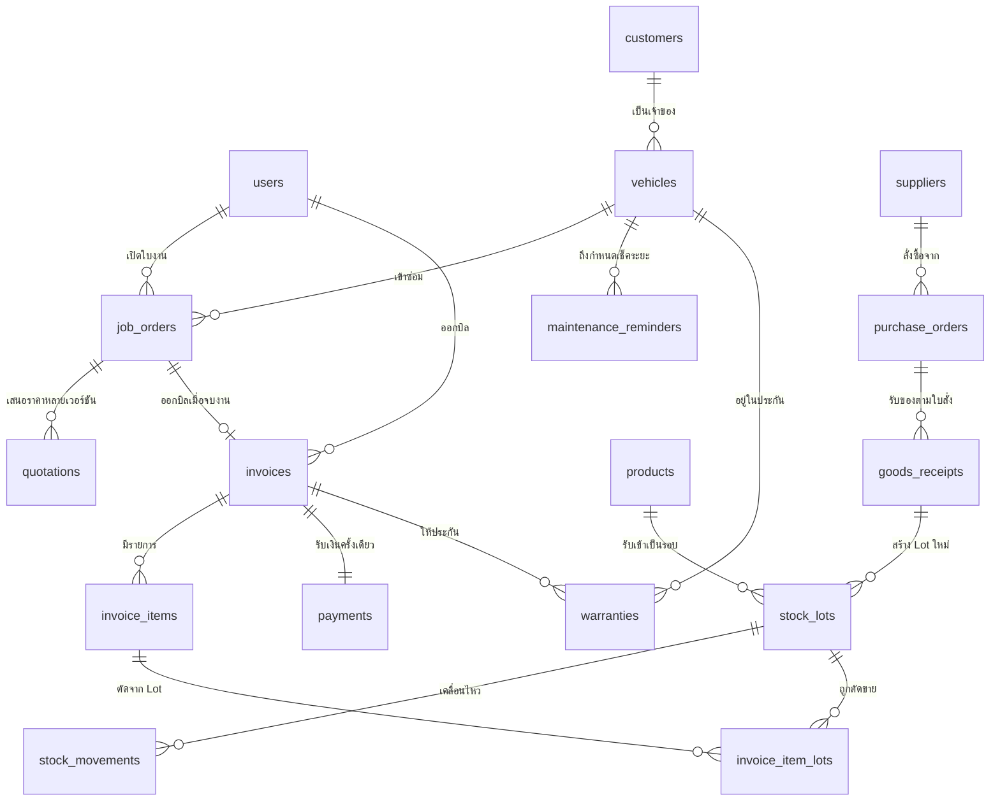
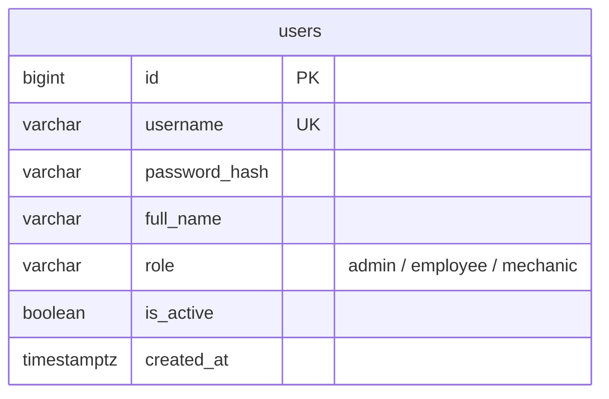
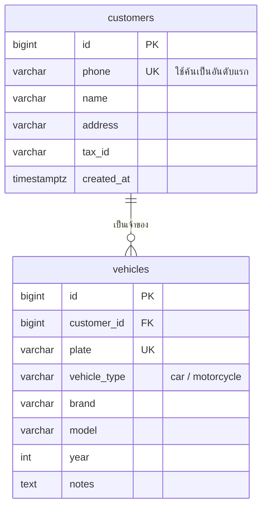
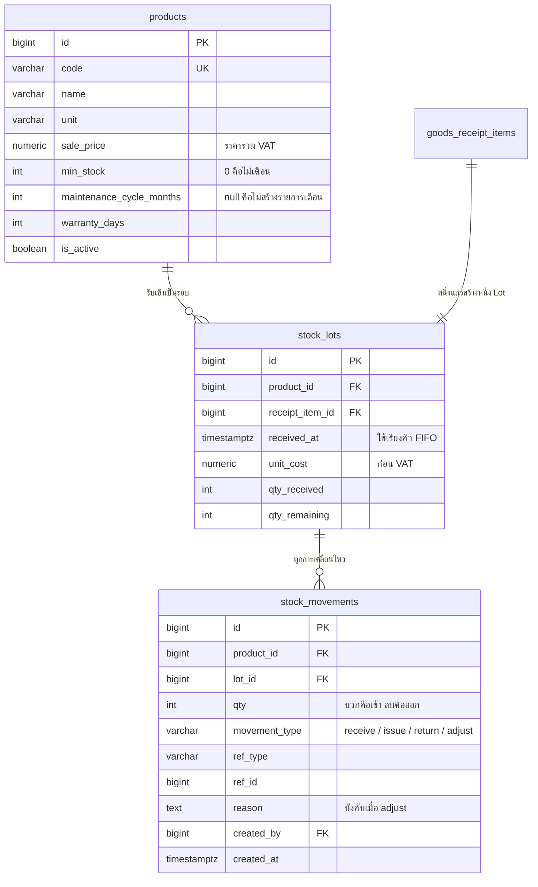
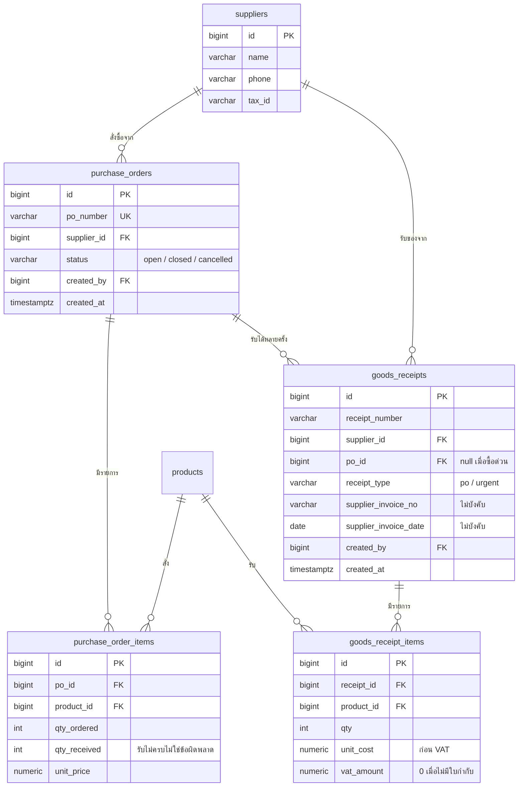
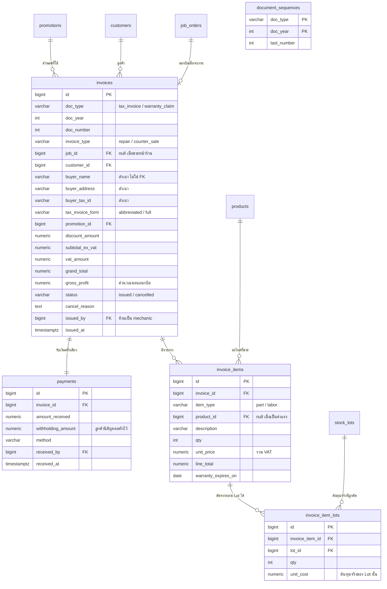
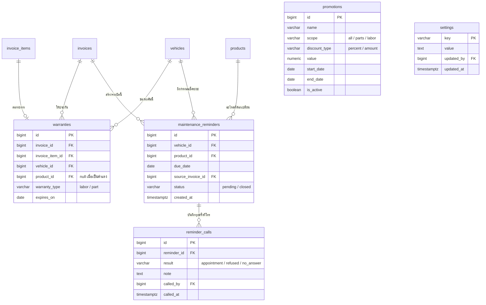

# โครงสร้างฐานข้อมูล

PostgreSQL อ้างอิงข้อตัดสินใจใน `new_scenario_summary.md` และหน้าจอใน `screens.md`

**26 ตาราง** เงินทุกคอลัมน์เป็น `numeric(12,2)` วันเวลาเป็น `timestamptz` `id` ของทุกตารางเป็น `bigserial`

สถานะการสร้างจริง — ตาราง `users` สร้างแล้ว (migration `0001`) ที่เหลือทยอยสร้างตามเฟสในแผน

---

## ภาพรวมความสัมพันธ์



เส้นที่ต้องอธิบายได้ตอนสอบ

- **`vehicles ||--o{ job_orders`** รถหนึ่งคันมีใบงานได้หลายใบ**ตลอดประวัติ** แต่ที่ยัง**ค้างอยู่**ได้ใบเดียว ซึ่งบังคับด้วย partial unique index ไม่ใช่ด้วยชนิดความสัมพันธ์
- **`job_orders ||--o| invoices`** ใบงานหนึ่งใบออกบิลได้ไม่เกินหนึ่งใบ และบิลขายหน้าร้านไม่มีใบงานเลย `job_id` จึงเป็น null ได้
- **`invoice_items ||--o{ invoice_item_lots`** หนึ่งรายการขายอาจกินหลาย Lot ตารางกลางนี้คือตัวที่ทำให้รู้ต้นทุนจริงและคืนของกลับ Lot เดิมได้

---

## 1. ผู้ใช้



`role` บังคับด้วย `CheckConstraint` ที่ฐานข้อมูล ไม่ใช่แค่ในโค้ด

ทุกตารางที่บันทึกการกระทำอ้าง `users.id` ผ่านคอลัมน์ `*_by` ไม่มีการกระทำไหนที่ไม่รู้ว่าใครทำ

---

## 2. ลูกค้าและรถ



ลูกค้าขาจรที่ซื้อของหน้าร้านไม่ถูกบันทึกใน `customers` ข้อมูลผู้ซื้อ (ถ้าขอใบกำกับเต็มรูป)
ไปอยู่บนบิลโดยตรง

---

## 3. สินค้าและคลัง



**`stock_lots` คือหัวใจของระบบ** หนึ่งครั้งที่รับของ = หนึ่ง Lot เสมอ ไม่ว่าจะมาทางใบสั่งซื้อหรือ
ซื้อด่วน หัวเทียนทุน 80 กับทุน 120 จึงอยู่คนละแถว ทำให้คิดกำไรได้แม่น

FIFO เรียงตาม `received_at` แล้ว `id` ส่วน `qty_remaining` เป็นตัวเลขที่เก็บไว้จริง ไม่คำนวณสด
จาก movements เพราะทุกการตัดสต็อกต้อง lock แถวอยู่แล้ว

`stock_movements` คือบัญชีเดินสะพัดของคลังทั้งหมด การคืนของอ้าง `lot_id` เดิมเสมอ ไม่สร้าง Lot ใหม่
ต้นทุนจึงไม่เพี้ยน

---

## 4. จัดซื้อ



`receipt_type = urgent` คือซื้อด่วนหน้างาน `po_id` เป็น null

ใบกำกับของร้านเป็นข้อมูลไม่บังคับ เพราะร้านเล็กมักไม่ออกให้ ถ้า `supplier_invoice_no` เป็น null
ใบรับนั้นไม่เข้ารายงานภาษีซื้อ และ `unit_cost` คือราคาที่จ่ายทั้งจำนวนโดยไม่แยก VAT

---

## 5. ใบงานและใบเสนอราคา


**`waiting_parts` เป็นคอลัมน์แยกจาก `status` ไม่ใช่ค่าหนึ่งใน status** เพราะช่างทำงานส่วนอื่นต่อได้
ระหว่างรออะไหล่ รถจึงอยู่สถานะ `in_progress` และติดป้ายรออะไหล่พร้อมกันได้

`status` เดินหน้าทางเดียว `pending → in_progress → done → closed` ส่วน `cancelled` แยกออกมา

ใบเสนอราคาเก็บทุกเวอร์ชัน ใบเก่าเปลี่ยนเป็น `superseded` ไม่ถูกลบ แถวที่ `status = approved`
แก้ไม่ได้ บังคับด้วย trigger

ตอนอนุมัติเวอร์ชันใหม่ ระบบเทียบกับเวอร์ชันที่อนุมัติไปก่อนหน้าแล้วตัดหรือคืน**เฉพาะส่วนต่าง**
ไม่คืนทั้งชุดแล้วตัดใหม่

---

## 6. บิลและการรับเงิน



**`(doc_type, doc_year, doc_number)` เป็น unique** งานเคลมอยู่คนละ `doc_type` จึงไม่กิน
เลขใบกำกับตามที่ตกลงไว้

**ข้อมูลผู้ซื้อสามคอลัมน์เป็นสำเนา ไม่ใช่ foreign key** ลูกค้าย้ายที่อยู่แล้วใบกำกับเก่าไม่เปลี่ยนตาม
ถ้าอ่านสดจาก `customers` เท่ากับแก้เอกสารภาษีย้อนหลัง

**`invoice_item_lots` คือตารางที่ทำให้ระบบนี้ต่างจากโปรแกรมขายทั่วไป** ถ้าไม่มีตารางนี้จะรู้แค่ว่า
ขายอะไรไป แต่ไม่รู้ว่าตัดมาจาก Lot ไหน แปลว่าคิดกำไรจริงไม่ได้และคืนของกลับ Lot เดิมไม่ได้

`payments` รับครั้งเดียวต่อบิล ระบบถือว่าครบเมื่อ `amount_received + withholding_amount = grand_total`
แล้วปิดใบงานอัตโนมัติ

---

## 7. โปรโมชั่น รับประกัน และรอบบำรุงรักษา



บิลเก็บ `promotion_id` ไว้อ้างอิงแต่ยอดส่วนลดจริงเก็บเป็นตัวเลขที่ `invoices.discount_amount`
แก้โปรโมชั่นทีหลังจึงไม่กระทบบิลเก่า

`warranties` สร้างตอนออกบิลงานซ่อม หน้ารับรถเข้าอู่อ่านตารางนี้ด้วย `vehicle_id` กับ
`expires_on >= today` บิลขายหน้าร้านไม่สร้างแถวที่นี่เพราะไม่มีรถผูก

หนึ่งคู่ (รถ, สินค้า) มีรายการเตือนที่ยัง `pending` ได้รายการเดียว ถ้าลูกค้ากลับมาเปลี่ยนตัวเดิม
ก่อนกำหนด รายการเดิมถูกปิดแล้วสร้างรอบใหม่แทน ไม่เตือนซ้อน

`reminder_calls` เก็บทุกครั้งที่โทร ไม่ทับของเดิม เพราะ KPI นับจำนวนครั้งที่โทรด้วย

`settings` เก็บข้อมูลอู่สำหรับหัวบิล จำนวนวันรับประกันค่าแรงเริ่มต้น และจำนวนวันที่นับว่าของค้างคลัง
(ค่าเริ่มต้น 90)

---

## กฎที่ต้องบังคับในฐานข้อมูล ไม่ใช่ในโค้ดอย่างเดียว

**หนึ่งคันหนึ่งใบงานค้าง**

```sql
create unique index job_orders_one_active_per_vehicle
  on job_orders (vehicle_id)
  where status not in ('closed', 'cancelled');
```

**เลขที่เอกสารห้ามข้าม — ห้ามใช้ SEQUENCE ของ PostgreSQL**

`nextval()` ไม่ย้อนกลับเมื่อทรานแซกชัน rollback เลขจะหายไปหนึ่งใบทันทีที่บันทึกไม่สำเร็จ ซึ่งคือ
สิ่งที่ระบบพยายามกันไว้ตั้งแต่ต้น ต้องออกเลขด้วยการ lock แถวใน `document_sequences`
ในทรานแซกชันเดียวกับการ insert บิล

```sql
update document_sequences
   set last_number = last_number + 1
 where doc_type = $1 and doc_year = $2
returning last_number;
```

**การตัดสต็อก FIFO**

```sql
select * from stock_lots
 where product_id = $1 and qty_remaining > 0
 order by received_at, id
   for update;
```

แล้วไล่หัก `qty_remaining` พร้อมเขียน `stock_movements` ในทรานแซกชันเดียวกัน การ lock ตามลำดับ
เดียวกันเสมอกัน deadlock เมื่อสองใบงานตัดสินค้าตัวเดียวกันพร้อมกัน

**qty_remaining ห้ามติดลบ** — `check (qty_remaining >= 0 and qty_remaining <= qty_received)`

**ช่างหลักได้คนเดียวต่อใบงาน**

```sql
create unique index job_order_one_primary_mechanic
  on job_order_mechanics (job_id)
  where is_primary;
```

**ช่างห้ามอนุมัติใบเสนอราคาและห้ามออกบิล** — บังคับที่ชั้นแอปพลิเคชัน และย้ำด้วย constraint
ที่ตรวจว่า `approved_by` และ `issued_by` ต้องไม่ใช่ผู้ใช้ที่ `role = 'mechanic'`

**ยกเลิกใบงานได้เฉพาะตอนยังไม่แตะของ** — ตรวจว่าไม่มี `stock_movements` แบบ issue ที่อ้าง
ใบงานนั้น ถ้ามีต้องไปทางออกบิลแทน

---

## จุดที่ควรระวังตอน implement

- **กำไรคำนวณตอนออกบิล** จากยอดขายก่อน VAT หลังหักส่วนลด ลบผลรวม `invoice_item_lots.qty * unit_cost`
  ทั้งสองฝั่งเป็นฐานก่อน VAT ถ้าเผลอเอา `grand_total` มาลบต้นทุน กำไรจะเกินจริง 7% ทุกใบ
- **ราคาบนหน้าจอรวม VAT แต่ในบิลต้องแยก** `subtotal_ex_vat = round(ยอดรวม / 1.07, 2)` แล้ว
  `vat_amount = grand_total - subtotal_ex_vat` เพื่อให้ผลรวมกลับมาเท่าเดิมเสมอ ไม่ปัดเศษสองรอบแยกกัน
- **ยกเลิกบิล** ต้องคืนของตาม `invoice_item_lots` กลับเข้า Lot เดิม เขียน `stock_movements` แบบ return
  และล้าง `gross_profit` แต่ห้ามลบแถวบิลและห้ามคืนเลขที่เอกสาร
- **รับของแล้วตัดให้ใบงานที่รออยู่** ทำในทรานแซกชันเดียวกับการรับของ เรียงตามเวลาที่ใบเสนอราคา
  ได้รับอนุมัติ ตัดครบแล้วเซ็ต `waiting_parts = false`
