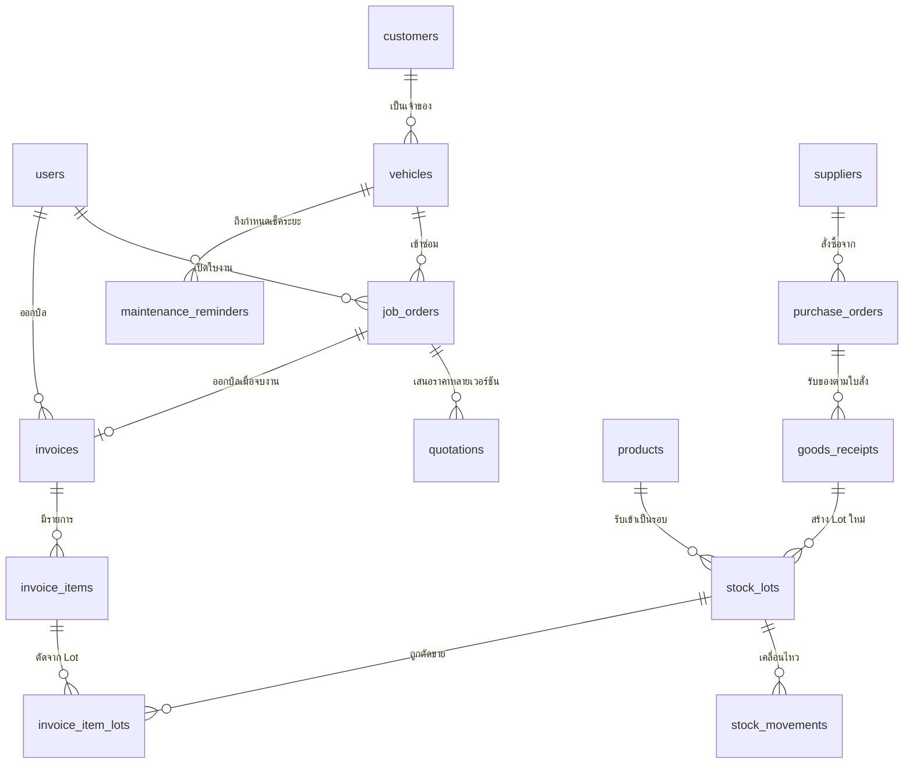
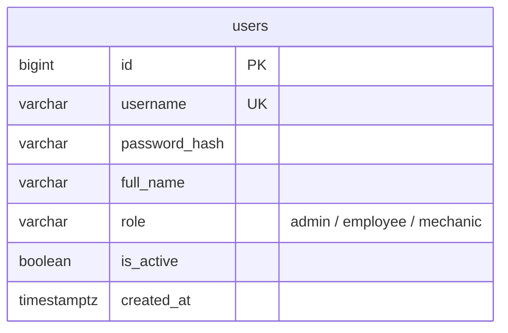
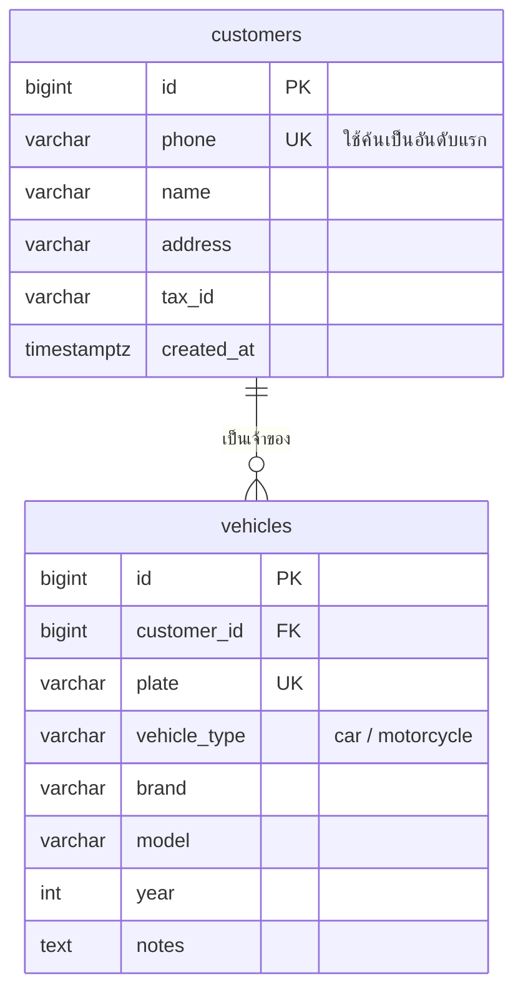
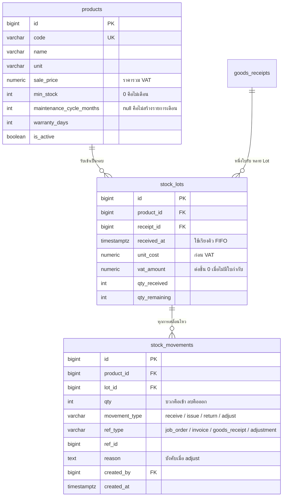
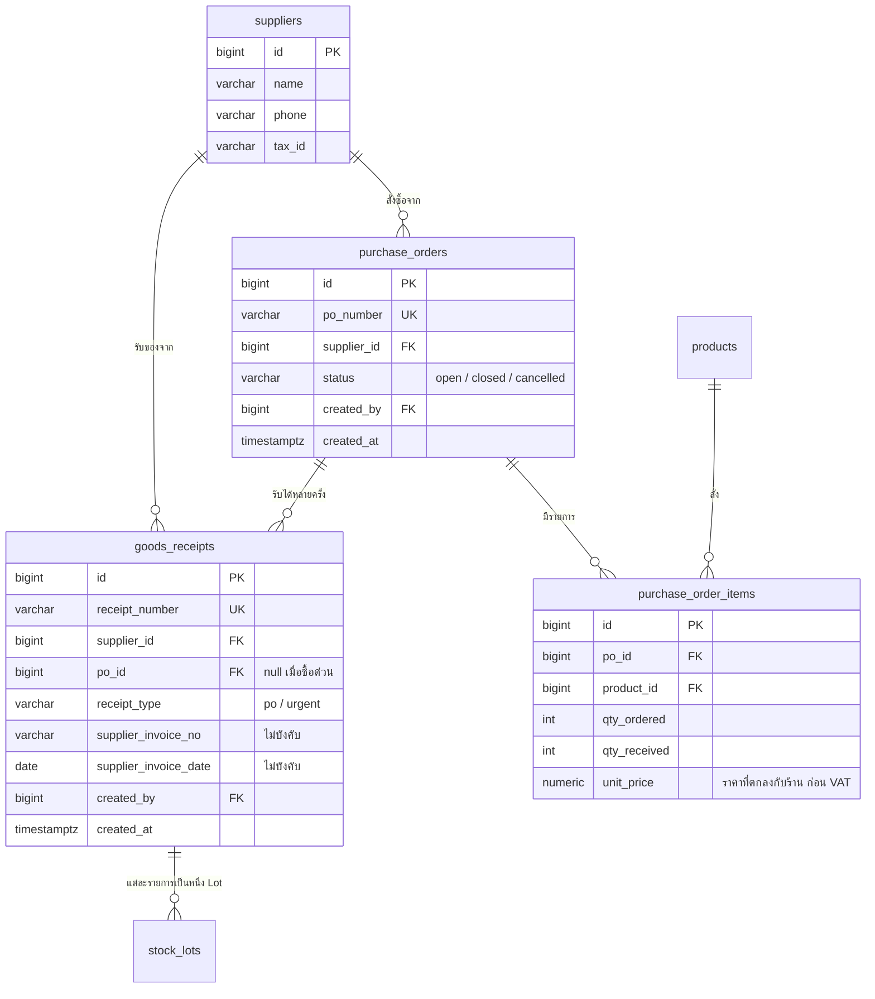
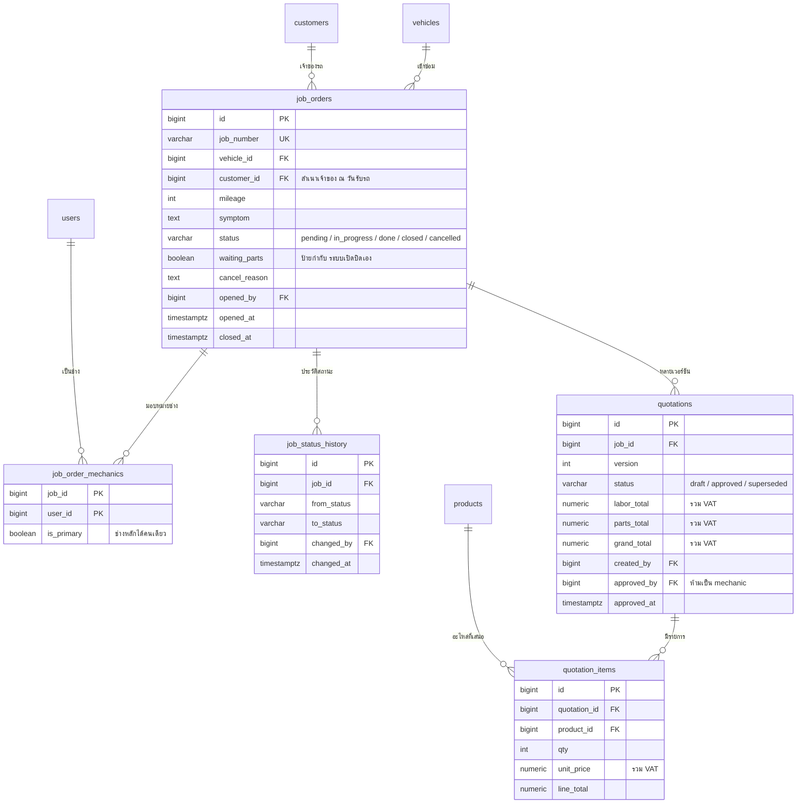
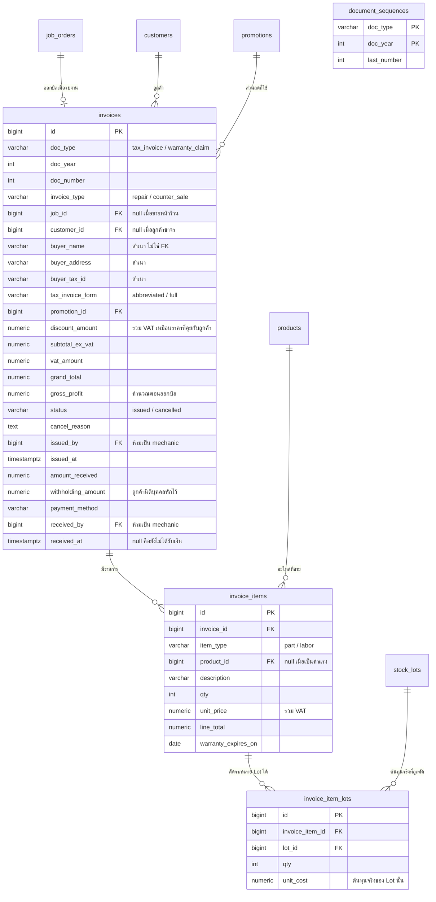
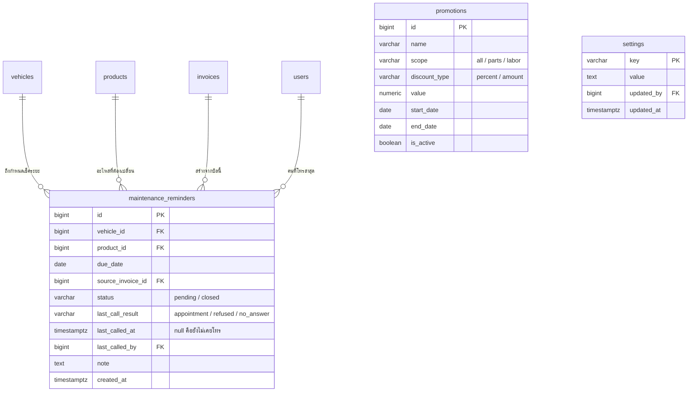

# โครงสร้างฐานข้อมูล

PostgreSQL — 22 ตาราง อ้างอิง `new_scenario_summary.md` และ `screens.md`

เงินทุกคอลัมน์เป็น `numeric(12,2)` วันเวลาเป็น `timestamptz` `id` ของทุกตารางเป็น `bigserial`

---

## ภาพรวม



- รถหนึ่งคันมีใบงานได้หลายใบตลอดประวัติ แต่ที่ค้างอยู่ได้ใบเดียว บังคับด้วย partial unique index
- ใบงานหนึ่งใบออกบิลได้ไม่เกินหนึ่งใบ บิลขายหน้าร้าน `job_id` เป็น null
- หนึ่งรายการขายกินได้หลาย Lot จึงต้องมี `invoice_item_lots` คั่นกลาง

---

## 1. ผู้ใช้



`role` บังคับด้วย `CheckConstraint` ที่ฐานข้อมูล ทุกตารางที่บันทึกการกระทำอ้าง `users.id` ผ่านคอลัมน์ `*_by`

---

## 2. ลูกค้าและรถ



ลูกค้าขาจรที่ซื้อของหน้าร้านไม่ถูกบันทึกที่นี่ ข้อมูลผู้ซื้อไปอยู่บนบิลโดยตรง

---

## 3. สินค้าและคลัง



- หนึ่งสินค้าที่รับเข้ามาหนึ่งครั้ง = หนึ่ง Lot เสมอ ไม่ว่าจะมาทางใบสั่งซื้อหรือซื้อด่วน
- FIFO เรียงตาม `received_at` แล้ว `id`
- `qty_remaining` เก็บเป็นตัวเลขจริง ไม่คำนวณสดจาก movements
- การคืนของอ้าง `lot_id` เดิมเสมอ ไม่สร้าง Lot ใหม่
- **สต็อกตัดตอนใบเสนอราคาได้รับอนุมัติ ไม่ใช่ตอนออกบิล** การตัดครั้งนั้นเขียน `stock_movements` ที่
  `ref_type = 'job_order'` และ `ref_id` เป็นเลขใบงาน ตารางนี้จึงเป็นที่เดียวที่รู้ว่าใบงานกินไปกี่ชิ้นจาก Lot ไหน
  ทั้งหน้าจอรายละเอียดใบงานและการสร้าง `invoice_item_lots` ตอนออกบิลอ่านจากที่นี่

---

## 4. จัดซื้อ



- `receipt_type = urgent` คือซื้อด่วนหน้างาน `po_id` เป็น null
- ไม่มีใบกำกับของร้าน = ไม่เข้ารายงานภาษีซื้อ และ `unit_cost` คือราคาที่จ่ายทั้งจำนวนโดยไม่แยก VAT
- รับของไม่ครบตามใบสั่งซื้อได้

---

## 5. ใบงานและใบเสนอราคา



- `waiting_parts` เป็นคอลัมน์แยกจาก `status` เพราะช่างทำงานส่วนอื่นต่อได้ระหว่างรออะไหล่
- `status` เดินหน้าทางเดียว `pending → in_progress → done → closed` ส่วน `cancelled` แยกออกมา
- ใบเสนอราคาเก็บทุกเวอร์ชัน ใบเก่าเป็น `superseded` แถวที่ `approved` แก้ไม่ได้ บังคับด้วย trigger
- อนุมัติเวอร์ชันใหม่แล้วตัดหรือคืนเฉพาะส่วนต่างจากเวอร์ชันก่อนหน้า

---

## 6. บิลและการรับเงิน



- `(doc_type, doc_year, doc_number)` เป็น unique งานเคลมอยู่คนละ `doc_type` จึงไม่กินเลขใบกำกับ
- ข้อมูลผู้ซื้อสามคอลัมน์เป็นสำเนา ไม่ใช่ foreign key ลูกค้าย้ายที่อยู่แล้วใบกำกับเก่าไม่เปลี่ยนตาม
- รับเงินครบทีเดียว ระบบถือว่าครบเมื่อ `amount_received + withholding_amount = grand_total` แล้วปิดใบงานอัตโนมัติ
- บิลที่ `grand_total = 0` เช่นเอกสารส่งมอบงานเคลม ปิดใบงานตั้งแต่ตอนออกเอกสาร ไม่ต้องกดรับเงิน
- `received_at is null` คือเงื่อนไข "ยังไม่ได้รับเงิน" ใช้ตรวจตอนยกเลิกบิล คู่กับเงื่อนไขบิลของวันนี้
- ค่าแรงเป็นแถวเดียวต่อบิล `item_type = labor` และ `product_id` เป็น null บิลขายหน้าร้านมีแถว labor ไม่ได้
- **ออกบิลกับรับเงินเป็นสองจังหวะ** ตอนออกบิลจองเลขที่ คัดลอกข้อมูลผู้ซื้อ คำนวณ `gross_profit`
  วันหมดประกัน และสร้างรายการเตือนรอบบำรุงรักษา แถวนั้น `received_at` ยังเป็น null
  ตอนรับเงินครบค่อยเซ็ต `amount_received` `received_by` `received_at` แล้วปิดใบงาน
- `invoice_item_lots` ของบิลงานซ่อมไม่ตัดสต็อกใหม่ สร้างจาก `stock_movements` ของใบงานที่ตัดไปแล้ว
  ส่วนบิลขายหน้าร้านตัด FIFO ตอนออกบิลเลยเพราะไม่มีใบงานมาก่อน
- รายงานภาษีขายกรอง `doc_type = 'tax_invoice'` เท่านั้น `warranty_claim` ไม่เข้ารายงาน

---

## 7. โปรโมชั่น รับประกัน และรอบบำรุงรักษา



- บิลเก็บ `promotion_id` ไว้อ้างอิง แต่ยอดส่วนลดจริงเก็บเป็นตัวเลขที่ `invoices.discount_amount`
- วันหมดประกันเก็บที่ `invoice_items.warranty_expires_on` ค่าแรงใช้จำนวนวันจากหน้าตั้งค่า อะไหล่ใช้ `products.warranty_days`
- หนึ่งคู่ (รถ, สินค้า) มีรายการเตือนที่ยัง `pending` ได้รายการเดียว เปลี่ยนก่อนกำหนดให้ปิดรายการเดิมแล้วสร้างใหม่
- `settings` เก็บข้อมูลอู่สำหรับหัวบิล รูปแบบเลขที่เอกสาร จำนวนวันรับประกันค่าแรง และจำนวนวันที่นับว่าของค้างคลัง

**ตรวจว่ารถคันนี้ยังอยู่ในประกันอะไรบ้าง**

```sql
select ii.description, ii.warranty_expires_on
  from invoice_items ii
  join invoices i   on i.id = ii.invoice_id
  join job_orders j on j.id = i.job_id
 where j.vehicle_id = $1
   and i.status = 'issued'
   and ii.warranty_expires_on >= current_date;
```

ต้องมี index ที่ `job_orders (vehicle_id)` และ `invoice_items (warranty_expires_on)`

---

## กฎที่ต้องบังคับในฐานข้อมูล

**หนึ่งคันหนึ่งใบงานค้าง**

```sql
create unique index job_orders_one_active_per_vehicle
  on job_orders (vehicle_id)
  where status not in ('closed', 'cancelled');
```

**ช่างหลักได้คนเดียวต่อใบงาน**

```sql
create unique index job_order_one_primary_mechanic
  on job_order_mechanics (job_id)
  where is_primary;
```

**หนึ่งใบงานออกบิลได้ใบเดียว**

```sql
create unique index invoices_one_per_job
  on invoices (job_id)
  where job_id is not null and status <> 'cancelled';
```

ยกเว้นบิลที่ยกเลิกไว้ ไม่งั้นออกบิลใหม่แทนใบที่ยกเลิกไม่ได้

**เลขที่เอกสารห้ามข้าม — ห้ามใช้ SEQUENCE ของ PostgreSQL**

`nextval()` ไม่ย้อนกลับเมื่อ rollback เลขจะหายทันทีที่บันทึกไม่สำเร็จ ต้อง lock แถวใน
`document_sequences` ในทรานแซกชันเดียวกับการ insert บิล

```sql
insert into document_sequences (doc_type, doc_year, last_number)
     values ($1, $2, 1)
on conflict (doc_type, doc_year)
  do update set last_number = document_sequences.last_number + 1
  returning last_number;
```

ต้องเป็น upsert เพราะแถวของปีใหม่ยังไม่มี ถ้าใช้ `update` เปล่า บิลใบแรกของทุกปีจะได้ 0 แถวกลับมา

**เลขที่เอกสารอื่นใช้ตารางเดียวกัน** `job_number` `po_number` `receipt_number` ออกจาก `document_sequences`
ด้วย `doc_type` เป็น `job` `po` `receipt` สามชุดนี้ข้ามเลขได้ไม่เป็นไร ไม่ต้องถือ lock ยาวเหมือนใบกำกับ
รูปแบบของทั้งสามต้องมีปีอยู่ในตัวเลขด้วย เพราะ `last_number` รีเซ็ตทุกปี ถ้าไม่มีปี เลขจะชนของเดิมในปีถัดไป

**ตัดสต็อกแบบ FIFO**

```sql
select * from stock_lots
 where product_id = $1 and qty_remaining > 0
 order by received_at, id
   for update;
```

ไล่หัก `qty_remaining` พร้อมเขียน `stock_movements` ในทรานแซกชันเดียวกัน การ lock ตามลำดับเดียวกัน
เสมอกัน deadlock เมื่อสองใบงานตัดสินค้าตัวเดียวกันพร้อมกัน

**qty_remaining ห้ามติดลบ**

```sql
check (qty_remaining >= 0 and qty_remaining <= qty_received)
```

**ช่างห้ามอนุมัติใบเสนอราคาและห้ามออกบิล** บังคับที่ชั้นแอปพลิเคชัน และตรวจว่า `approved_by`,
`issued_by`, `received_by` ต้องไม่ใช่ผู้ใช้ที่ `role = 'mechanic'`

**ยกเลิกใบงานได้เฉพาะตอนยังไม่แตะของ** ตรวจว่าไม่มี `stock_movements` แบบ issue ที่อ้างใบงานนั้น

---

## จุดที่ควรระวังตอน implement

- **กำไรคำนวณตอนออกบิล** จากยอดขายก่อน VAT หลังหักส่วนลด ลบผลรวม `invoice_item_lots.qty * unit_cost`
  ทั้งสองฝั่งเป็นฐานก่อน VAT ถ้าเอา `grand_total` มาลบต้นทุน กำไรจะเกินจริง 7% ทุกใบ
- **ราคาบนหน้าจอรวม VAT แต่ในบิลต้องแยก** `subtotal_ex_vat = round(ยอดรวม / 1.07, 2)` แล้ว
  `vat_amount = grand_total - subtotal_ex_vat` ไม่ปัดเศษสองรอบแยกกัน
- **ยกเลิกบิล** ทำได้เมื่อ `received_at is null` หรือ `issued_at::date = current_date` เงื่อนไขหลังมีไว้ให้
  บิลขายหน้าร้านที่รับเงินไปพร้อมกันในขั้นตอนเดียว คืนเงินสดจากลิ้นชักแล้วกดยกเลิก ข้ามวันไปแล้วยกเลิกไม่ได้
  คืนของตาม `invoice_item_lots` กลับเข้า Lot เดิม เขียน `stock_movements` แบบ return ล้าง `gross_profit`
  ปิดรายการเตือนที่ `source_invoice_id` เป็นบิลใบนั้น แต่ห้ามลบแถวบิลและห้ามคืนเลขที่เอกสาร
- **รับของแล้วตัดให้ใบงานที่รออยู่** ทำในทรานแซกชันเดียวกับการรับของ เรียงตามเวลาที่ใบเสนอราคา
  ได้รับอนุมัติ ตัดครบแล้วเซ็ต `waiting_parts = false`
